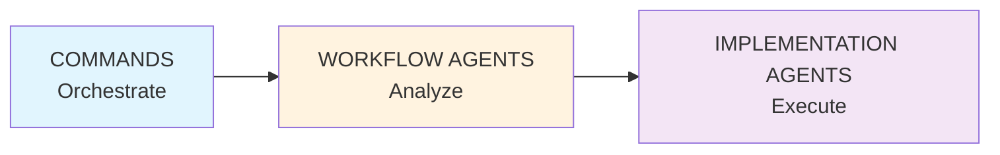
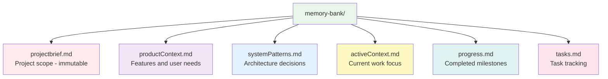

# CLAUDE.md

CCFlow orchestrates development through commands that coordinate specialized sub-agents. Each component has a single responsibility, creating clean, testable workflows with enforced quality gates.

## Primary Goal

**Specification-driven development enabling speed AND quality**

- **Specs First**: Define WHAT before HOW - every feature starts with specifications
- **TDD is Non-Negotiable**: RED → GREEN → REFACTOR enforced at every step
- **Quality Gates**: Prevent technical debt accumulation through systematic validation
- **Parallel Execution**: Maximize velocity without compromising quality

## Core Architecture



- **Commands**: Orchestrate workflows, no logic
- **Workflow Agents**: Analyze and plan, read-only tools
- **Implementation Agents**: Execute tasks, full tool access
- **Memory Bank**: Persistent context across sessions

## Command Domains

### 1. Project Initialization
**Setup and configure your project**
- `/cf:init` - Initialize CCFlow with memory bank
- `/cf:configure-team` - Install stack-specific teams
- `/cf:create-specialist` - Add domain specialists

### 2. Workflow Execution
**Core development loop**
- `/cf:feature` - Entry point → complexity routing (L1-L4)
- `/cf:plan` - Planning with Architect + Product agents
- `/cf:creative` - Deep exploration for L4 complexity
- `/cf:code` - TDD implementation (RED → GREEN → REFACTOR)
- `/cf:review` - Quality validation gate

### 3. State Management
**Persist and load project context**
- `/cf:checkpoint` - Save memory bank snapshot
- `/cf:context` - Load project context
- `/cf:sync` - Inspect memory bank status
- `/cf:git` - Smart commits with memory integration

### 4. Interactive Support
**Human-in-the-loop refinement**
- `/cf:ask [agent]` - Direct agent consultation
- `/cf:facilitate [topic]` - Interactive exploration
- `--interactive` flag - Add to any command for Facilitator engagement

### 5. Meta-Development
**System optimization and consistency**
- `/cf:refine-agent` - Optimize agents (target: 500-1500 tokens)
- `/cf:refine-command` - Optimize commands (via commandBuilder)
- `/cf:status` - Quick task overview

**Best Practice**: Always use meta-tools for ALL system modifications to ensure consistency

## Facilitator Pattern

Interactive modes follow this 5-step pattern:
1. **Present Current State** - Show what exists
2. **Identify Gaps/Concerns** - Find what's missing or unclear
3. **Ask Clarifying Questions** - Gather needed information
4. **Refine Based on Feedback** - Iterate with user input
5. **Always Recommend Next Action** - Never leave user without next step

## Complexity Routing

The Assessor agent automatically routes based on task complexity:

| Level | Criteria | Route |
|-------|----------|-------|
| **L1** | 1-2 files, clear scope, known pattern | → `/cf:code` |
| **L2** | 3-5 files, established patterns | → `/cf:plan` → `/cf:code` |
| **L3** | 5-15 files, some ambiguity, cross-cutting | → `/cf:plan --interactive` → `/cf:code` |
| **L4** | 15+ files, high uncertainty, architectural | → `/cf:plan` → `/cf:creative` → sub-tasks |

**Note**: Complexity is determined by scope and clarity, NOT temporal estimates. Never use time references in specifications or routing decisions.

## Agent Hierarchy

### Workflow Agents (`workflow/`)
**Decision layer - read-only tools**
- **Assessor**: Complexity analysis and routing
- **Architect**: Technical design decisions
- **Product**: User requirements and UX
- **Facilitator**: Interactive refinement through questions
- **Reviewer**: Quality validation
- **Documentarian**: Memory bank consistency

### Implementation Agents (`generic/` or `[stack]/`)
**Execution layer - full tool access**
- **testEngineer**: Write failing tests (RED phase)
- **codeImplementer**: Make tests pass (GREEN phase)
- **uiDeveloper**: Frontend-specific implementation
- **[Specialists]**: Domain-specific agents (optional)

### System Agents (`system/`)
**Meta-development - CCFlow optimization**
- **agentBuilder**: Agent creation and refinement
- **commandBuilder**: Command optimization
- **project-discovery**: Project analysis during init

## Agent Communication Patterns

Critical architectural rules that enforce clean separation:

- **No Direct Agent-to-Agent**: Agents cannot invoke other agents directly
- **Single Layer Deep**: Claude Code only supports main → sub-agent (no sub-sub-agents)
- **Status Transitions**: ASSESSED → PLANNED → TESTING → IMPLEMENTING → REVIEWING
- **Context Passing**: Via command context or memory bank files
- **Tool Isolation**: Each agent has minimal required tools (see Permission Matrix in docs)

## TDD Enforcement (GREEN Gate)

**TDD is the foundation of quality - enforced systematically, no exceptions**

1. **RED**: testEngineer writes failing tests FIRST (specification as tests)
2. **GREEN**: Implementation agent makes tests pass (minimum viable code)
3. **REFACTOR**: Improve code while keeping tests green (maintain quality)
4. **3-Strike Rule**: After 3 failures → STOP, report blocker (prevent endless loops)
5. **No Bypass**: Tasks cannot complete with failing tests (quality gate)

**Why TDD is Central**:
- Tests ARE the specification
- Prevents incomplete implementation
- Catches issues immediately when cheapest to fix
- Ensures memory bank reflects working state

## Memory Bank

Persistent context maintained across sessions:



**Update Strategy**:
- Commands auto-update during execution
- `/cf:checkpoint` creates formal savepoints
- Documentarian ensures cross-file consistency

## Workflow Patterns

### Standard Development Flow

```mermaid
graph LR
    F[/cf:feature] --> A[Assessor routes]
    A --> P[/cf:plan<br/>if L2+]
    P --> C[/cf:code]
    A --> C
    C --> R[/cf:review]
    R --> CH[/cf:checkpoint]

    style F fill:#e1f5fe
    style A fill:#fff3e0
    style P fill:#f3e5f5
    style C fill:#e8f5e9
    style R fill:#ffebee
    style CH fill:#fce4ec
```

### Session Management
```
Start: /cf:context          # Load state
Work:  /cf:checkpoint       # Regular intervals
End:   /cf:checkpoint → /cf:git  # Save and commit
```

### Getting Help
```
/cf:ask [agent] "question"        # Direct consultation
/cf:facilitate "topic"             # Interactive exploration
/cf:status                        # Quick overview
```

## Critical Principles

### Single Responsibility
- Each agent has ONE clear goal
- Commands orchestrate, agents execute
- No direct agent-to-agent communication

### Clean Context Windows
- Agents operate independently
- Context passed through command layer
- Parallel execution where possible

### Quality Gates
1. Complexity assessment (routing)
2. Planning validation (technical + user)
3. TDD enforcement (GREEN gate)
4. Quality review (standards)
5. Memory consistency (documentation)

### Specification-Based Development
- **Specs define behavior**: What the system should do, not how
- **Agents are instructions**: Markdown specs Claude reads and follows
- **Commands are procedures**: Orchestration steps, not executable code
- **Validation is explicit**: Each step must verify correctness
- **No temporal references**: Specs focus on scope/complexity, never time estimates

### Parallel vs Sequential Execution
- **Sequential (high-risk)**: Planning → Design → Test Writing → Implementation
- **Parallel (safe)**: Multiple file edits, independent test runs, documentation updates
- **Performance optimization**: Identify independent operations for concurrent execution
- **Context isolation**: Each agent operates in clean context window

## Quick Reference

### Common Commands by Workflow Stage

**Starting Work**: `/cf:feature` → automatic routing
**Planning**: `/cf:plan` → add `--interactive` if unclear
**Building**: `/cf:code` → enforces TDD
**Validating**: `/cf:review` → quality check
**Saving**: `/cf:checkpoint` → memory snapshot

### Agent Invocation Rules
- Commands invoke agents via Task tool
- Agents cannot invoke other agents
- Single layer deep (no sub-sub-agents)
- Clean context per invocation

### Specialist Pattern
When patterns repeat 3+ times:
```bash
/cf:create-specialist [domain] --type [development|testing] --name [agentName]
```

## Implementation Notes

Critical operational requirements:
- **Command Context**: Commands run from project root with `memory-bank/` present
- **Error Recovery**: Commands detect missing prerequisites and provide fix commands
- **Specialist Discovery**: Implementation agents check `specialists/` subdirectory
- **Auto-Facilitation**: Level 3-4 tasks automatically enable interactive mode

## Documentation Standards

**Diagramming**: Use Mermaid for all diagrams (architecture, workflows, relationships)

For detailed information, see:
- `docs/architecture/` - System design details
- `docs/workflows/` - Complete workflow examples
- `docs/agents/` - Agent specifications
- `docs/commands/` - Command documentation
- `docs/troubleshooting/` - Common issues and solutions

---

**Version**: 2.0 (Specification-Driven)
**Core Principles**:
- Specification-driven development (specs before code)
- TDD enforcement through GREEN gate (no exceptions)
- No temporal references in specs or routing
**Architecture**: Commands orchestrate → Agents analyze → Agents execute