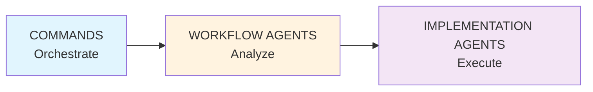
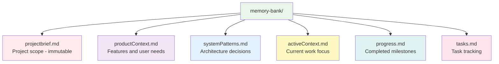

# CLAUDE.md

CCFlow orchestrates development through commands that coordinate specialized sub-agents. Each component has a single responsibility, creating clean, testable workflows with enforced quality gates.

---

## Primary Goal

**Specification-driven development enabling speed AND quality**

- **Specs First**: Define WHAT before HOW - every feature starts with specifications
- **TDD is Non-Negotiable**: RED → GREEN → REFACTOR enforced at every step
- **Quality Gates**: Prevent technical debt accumulation through systematic validation
- **Parallel Execution**: Maximize velocity without compromising quality

---

## Core Architecture



**Three-Layer Model**:
- **Commands**: Orchestrate workflows, no logic
- **Workflow Agents**: Analyze and plan, read-only tools
- **Implementation Agents**: Execute tasks, full tool access
- **Memory Bank**: Persistent context across sessions

---

## Command Categories

### 1. Project Initialization
Setup and configure - `/cf:init`, `/cf:configure-team`, `/cf:create-specialist`, `/cf:reset`

### 2. Workflow Execution
Core development loop - `/cf:feature`, `/cf:plan`, `/cf:creative`, `/cf:code`, `/cf:review`

### 3. State Management
Persist and load context - `/cf:checkpoint`, `/cf:context`, `/cf:sync`, `/cf:status`, `/cf:git`

### 4. Interactive Support
Human-in-the-loop - `/cf:ask`, `/cf:facilitate`, `--interactive` flag

### 5. Meta-Development
System optimization - `/cf:refine-agent`, `/cf:refine-command`

**Complete reference**: `docs/commands/README.md` - All commands with usage and examples

---

## Complexity Routing

Assessor agent automatically routes based on task complexity:

| Level | Criteria | Route |
|-------|----------|-------|
| **L1** | 1-2 files, clear scope, known pattern | → `/cf:code` |
| **L2** | 3-5 files, established patterns | → `/cf:plan` → `/cf:code` |
| **L3** | 5-15 files, some ambiguity, cross-cutting | → `/cf:plan --interactive` → `/cf:code` |
| **L4** | 15+ files, high uncertainty, architectural | → `/cf:plan` → `/cf:creative` → sub-tasks |

**Note**: Complexity determined by scope and clarity, NOT temporal estimates.

---

## Agent Architecture

CCFlow agents follow a **two-tier architecture** separating framework-level agents (consistent across all projects) from project-level agents (customized per project).

### Framework-Level Agents (Not Customizable)

**System Agents** (`.claude/agents/system/`):
- agentBuilder, commandBuilder, project-discovery
- Meta-development and framework optimization

**Workflow Agents** (`.claude/agents/workflow/`):
- assessor, architect, product, facilitator, documentarian, reviewer
- Decision layer providing consistent CCFlow workflow behavior
- **Why not customizable**: Ensures predictable workflows and quality gates

### Project-Level Agents (Customizable)

**Generic Implementation Agents** (`.claude/agents/`):
- testEngineer, codeImplementer, uiDeveloper
- **Must customize**: Fill TODO sections for tech stack, coding standards, testing approach

**Team-Specific Agents** (`.claude/agents/[team-type]/`):
- Added via `/cf:configure-team` for stack optimization

**Specialists** (`.claude/agents/specialists/`):
- Created via `/cf:create-specialist` for recurring patterns (3+ times)
- Domain-specific expertise (auth, payments, migrations, etc.)

**Complete details**: `docs/architecture/agent-organization.md`

---

## Critical Rules

### 1. Agent Communication
- **No Direct Agent-to-Agent**: Agents cannot invoke other agents directly
- **Single Layer Deep**: Claude Code supports main → sub-agent only (no sub-sub-agents)
- **Context Passing**: Via command context or memory bank files

### 2. TDD Enforcement (GREEN Gate)
1. **RED**: testEngineer writes failing tests FIRST
2. **GREEN**: Implementation agent makes tests pass (minimum code)
3. **REFACTOR**: Improve code while keeping tests green
4. **3-Strike Rule**: After 3 failures → STOP, report blocker
5. **No Bypass**: Tasks cannot complete with failing tests

**Why**: Tests ARE the specification, prevents incomplete implementation

### 3. Specification-Based Development
- **Specs define behavior**: What the system should do, not how
- **Agents are instructions**: Markdown specs Claude reads and follows
- **No temporal references**: Specs focus on scope/complexity, never time estimates

### 4. Quality Gates
1. Complexity assessment (routing)
2. Planning validation (technical + user)
3. TDD enforcement (GREEN gate)
4. Quality review (standards)
5. Memory consistency (documentation)

### 5. Memory Bank Structure
Six files maintain persistent context:
- `projectbrief.md` - Project scope (immutable)
- `productContext.md` - Features and user needs
- `systemPatterns.md` - Architecture decisions
- `activeContext.md` - Current work focus
- `progress.md` - Completed milestones
- `tasks.md` - Task tracking

---

## Memory Bank

Persistent context maintained across sessions:



**Update Strategy**: Commands auto-update during execution, `/cf:checkpoint` creates formal savepoints, Documentarian ensures cross-file consistency

---

## Standard Development Flow

```mermaid
graph LR
    F[/cf:feature] --> A[Assessor routes]
    A --> P[/cf:plan<br/>if L2+]
    P --> C[/cf:code]
    A --> C
    C --> R[/cf:review]
    R --> CH[/cf:checkpoint]

    style F fill:#e1f5fe
    style A fill:#fff3e0
    style P fill:#f3e5f5
    style C fill:#e8f5e9
    style R fill:#ffebee
    style CH fill:#fce4ec
```

**Session Pattern**: Start with `/cf:context` → Work → Checkpoint regularly → End with `/cf:checkpoint` + `/cf:git`

**See**: `docs/workflows/session-management.md` for detailed session patterns

---

## Documentation Standards

**All documentation belongs in `docs/` folder**:
- `docs/architecture/` - System design, agent organization, operational requirements
- `docs/workflows/` - Workflow guides (facilitator pattern, session management, specialist creation)
- `docs/commands/` - Complete command reference
- `docs/agents/` - Agent specifications and customization guides
- `docs/troubleshooting/` - Common issues and solutions
- `docs/planning/` - Design decisions and planning documents

**Rules**:
- **Never**: Create README files scattered throughout `.claude/` structure
- **Always**: Centralize documentation in `docs/` with clear organization
- **Diagramming**: Use Mermaid for all diagrams

---

**Version**: 2.0 (Specification-Driven)
**Architecture**: Commands orchestrate → Agents analyze → Agents execute
**Core Principles**: Specs before code | TDD non-negotiable | Quality gates enforced
