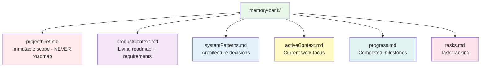

# CLAUDE.md

CCFlow orchestrates development through commands that coordinate specialized sub-agents. Each component has a single responsibility, creating clean, testable workflows with enforced quality gates.

---

## Primary Goal

**Specification-driven development enabling speed AND quality**

- **Specs First**: Define WHAT before HOW - every feature starts with specifications
- **TDD is Non-Negotiable**: RED → GREEN → REFACTOR enforced at every step
- **Quality Gates**: Prevent technical debt accumulation through systematic validation
- **Parallel Execution**: Maximize velocity without compromising quality

---

## Core Architecture


**Three-Layer Model**:
- **Commands**: Orchestrate workflows, no logic
- **Workflow Agents**: Analyze and plan, read-only tools
- **Implementation Agents**: Execute tasks, full tool access
- **Memory Bank**: Persistent context across sessions

---

## Command Categories

### 1. Project Initialization
Setup and configure - `/cf:init`, `/cf:configure-team`, `/cf:create-specialist`, `/cf:reset`

### 2. Workflow Execution
Core development loop - `/cf:feature`, `/cf:plan`, `/cf:creative`, `/cf:code`, `/cf:review`

### 3. State Management
Persist and load context - `/cf:checkpoint`, `/cf:context`, `/cf:sync`, `/cf:status`, `/cf:git`

### 4. Interactive Support
Human-in-the-loop - `/cf:ask`, `/cf:facilitate`, `--interactive` flag

### 5. Meta-Development
System optimization - `/cf:refine-agent`, `/cf:refine-command`

**Complete reference**: `docs/commands/README.md` - All commands with usage and examples

---

## Complexity Routing

Assessor agent automatically routes based on task complexity:

| Level | Criteria | Architect Pre-Analysis | Route |
|-------|----------|----------------------|-------|
| **L1** | 1-2 files, clear scope, known pattern | Skipped (efficiency) | → `/cf:code` |
| **L2** | 3-5 files, established patterns | **✅ Invoked** (6-8 min) | → `/cf:plan` → `/cf:code` |
| **L3** | 5-15 files, some ambiguity, cross-cutting | **✅ Invoked** (7-8 min) | → `/cf:plan --interactive` OR `/cf:creative` |
| **L4** | 15+ files, high uncertainty, architectural | **✅ Invoked** (8 min) | → `/cf:creative` → `/cf:plan` → sub-tasks |

**Note**: Complexity determined by scope and clarity, NOT temporal estimates.

**New in v2.0**: Conditional Architect pre-analysis (TASK-004) - Level 2+ features include technical analysis to catch hidden complexity (integration, data, algorithm, constraints) before implementation. Level 1 features skip pre-analysis for efficiency.

---

## Feature Specification with Conditional Orchestration

**New in v2.0** (TASK-004): `/cf:feature` uses conditional multi-agent orchestration to ensure specification completeness before implementation.

### How It Works

```mermaid
graph TD
    F[/cf:feature] --> ASS[Assessor<br/>Complexity Evaluation]
    ASS --> CHECK{Level?}

    CHECK -->|L1<br/>Simple| PROD1[Product Agent<br/>User Requirements]
    CHECK -->|L2+<br/>Complex| ARCH[Architect Agent<br/>Technical Pre-Analysis]

    ARCH --> PROD2[Product Agent<br/>User Requirements]

    PROD1 --> SYNTH[Command Synthesis]
    PROD2 --> SYNTH

    SYNTH --> SPEC[Complete Specification]

    style ASS fill:#fff3e0
    style ARCH fill:#e3f2fd
    style PROD1 fill:#f3e5f5
    style PROD2 fill:#f3e5f5
    style SYNTH fill:#e8f5e9
```

### Conditional Expert Pre-Analysis (Level 2+)

**Architect Pre-Analysis** (6-8 minutes, rapid assessment):
- **Integration Concerns**: Which components affected? (reads systemPatterns.md)
- **Data Modeling**: Entities, relationships, schema changes required
- **Algorithmic Complexity**: Performance implications, computational concerns
- **Technical Constraints**: Platform limits, security, dependencies
- **Hidden Complexity Signals**: 🔴 HIGH / 🟡 MEDIUM / 🟢 LOW priority specification needs

**Product Requirements** (2-3 minutes, always invoked):
- **User Need Analysis**: WHO, WHY, WHAT, WHEN, HOW (user perspective)
- **Acceptance Criteria**: Measurable user-facing requirements
- **Edge Cases**: User scenarios and error conditions
- **NFRs**: Performance, accessibility, security from user perspective

**Command Synthesis** (orchestration layer):
- **IF Level 2+**: Synthesizes Product + Architect → complete specification
  - Acceptance criteria combine user requirements + technical concerns
  - Edge cases combine user scenarios + technical risks
  - NFRs combine UX requirements + technical constraints
- **IF Level 1**: Uses Product requirements directly (no synthesis)

### Domain Separation

**Key Architecture Pattern** (systemPatterns.md:719-938):
- **Product Agent**: Pure user focus (WHO/WHY/WHAT users need)
- **Architect Agent**: Pure technical focus (integration/data/algorithm/constraints)
- **Command**: Performs cross-domain synthesis at orchestration layer
- **No cross-agent dependencies**: Agents analyze independently

### Specification Completeness

**Problem Solved**: Features often reveal hidden complexity during implementation, forcing "stop and spec" pauses for:
- Integration complexity when connecting to existing components
- Data structure questions when implementing storage
- Algorithmic complexity when implementing business logic
- Edge cases surfacing mid-coding

**Solution**: Conditional expert pre-analysis catches these concerns upfront for Level 2+ features, while preserving efficiency for simple Level 1 features.

**See**: `docs/commands/cf-feature.md`, `docs/testing/task-004-validation.md` (5 test scenarios)

---

## Agent Architecture

CCFlow agents follow a **two-tier architecture** separating framework-level agents (consistent across all projects) from project-level agents (customized per project).

### Framework-Level Agents (Not Customizable)

**System Agents** (`.claude/agents/system/`):
- agent-builder, command-builder, project-discovery
- Meta-development and framework optimization

**Workflow Agents** (`.claude/agents/workflow/`):
- assessor, architect, product, facilitator, documentarian, reviewer
- Decision layer providing consistent CCFlow workflow behavior
- **Why not customizable**: Ensures predictable workflows and quality gates

### Project-Level Agents (Customizable)

**Generic Implementation Agents** (`.claude/agents/`):
- test-engineer, code-implementer, ui-developer
- **Must customize**: Fill TODO sections for tech stack, coding standards, testing approach

**Team-Specific Agents** (`.claude/agents/[team-type]/`):
- Added via `/cf:configure-team` for stack optimization

**Specialists** (`.claude/agents/specialists/`):
- Created via `/cf:create-specialist` for recurring patterns (3+ times)
- Domain-specific expertise (auth, payments, migrations, etc.)

**Complete details**: `docs/architecture/agent-organization.md`

---

## Critical Rules

### 1. Agent Communication
- **No Direct Agent-to-Agent**: Agents cannot invoke other agents directly
- **Single Layer Deep**: Claude Code supports main → sub-agent only (no sub-sub-agents)
- **Context Passing**: Via command context or memory bank files

### 2. TDD Enforcement (GREEN Gate)
1. **RED**: test-engineer writes failing tests FIRST
2. **GREEN**: Implementation agent makes tests pass (minimum code)
3. **REFACTOR**: Improve code while keeping tests green
4. **3-Strike Rule**: After 3 failures → STOP, report blocker
5. **No Bypass**: Tasks cannot complete with failing tests

**Why**: Tests ARE the specification, prevents incomplete implementation

### 3. Specification-Based Development
- **Specs define behavior**: What the system should do, not how
- **Agents are instructions**: Markdown specs Claude reads and follows
- **No temporal references**: Specs focus on scope/complexity, never time estimates

### 4. Quality Gates
1. Complexity assessment (routing + conditional expert analysis)
2. Specification completeness (technical pre-analysis for L2+)
3. Planning validation (technical + user)
4. TDD enforcement (GREEN gate)
5. Quality review (standards)
6. Memory consistency (documentation)

### 5. Memory Bank Structure
Six files maintain persistent context:
- `projectbrief.md` - Immutable scope (objectives, constraints, Decision Log only)
- `productContext.md` - Living roadmap (Features & Priorities, Feature Details, requirements)
- `systemPatterns.md` - Architecture decisions
- `activeContext.md` - Current work focus
- `progress.md` - Completed milestones
- `tasks.md` - Task tracking

**Architecture** (TASK-154): productContext.md contains the roadmap, NOT projectbrief.md

---

## Memory Bank

Persistent context maintained across sessions:



**File Responsibilities**:
- projectbrief.md = "What we're building" (immutable scope, never changes)
- productContext.md = "Features + roadmap" (living, updated by commands)

**Pattern Catalog** (v2.0 - TASK-005):
- `patterns/` - Individual pattern files (9 active patterns)
- `systemPatterns.md` - Master index with categorized navigation

**Update Strategy**: Commands auto-update during execution, `/cf:checkpoint` creates formal savepoints, Documentarian ensures cross-file consistency

**See**: `docs/workflows/pattern-management.md` for pattern addition workflow

---

## Standard Development Flow

```mermaid
graph LR
    F[/cf:feature] --> A[Assessor routes]
    A --> P[/cf:plan<br/>if L2+]
    P --> C[/cf:code]
    A --> C
    C --> R[/cf:review]
    R --> CH[/cf:checkpoint]

    style F fill:#e1f5fe
    style A fill:#fff3e0
    style P fill:#f3e5f5
    style C fill:#e8f5e9
    style R fill:#ffebee
    style CH fill:#fce4ec
```

**Session Pattern**: Start with `/cf:context` → Work → Checkpoint regularly → End with `/cf:checkpoint` + `/cf:git`

**See**: `docs/workflows/session-management.md` for detailed session patterns

---

## Documentation Standards

**All documentation belongs in `docs/` folder**:
- `docs/architecture/` - System design, agent organization, operational requirements
- `docs/workflows/` - Workflow guides (facilitator pattern, session management, specialist creation)
- `docs/commands/` - Complete command reference
- `docs/agents/` - Agent specifications and customization guides
- `docs/troubleshooting/` - Common issues and solutions
- `docs/planning/` - Design decisions and planning documents

**Templates belong in `.claude/templates/` folder**:
- `.claude/templates/workflow/` - Reusable templates for commands and workflow agents
  - Used by commands/agents to generate consistent output (specs, reports, summaries)
  - Examples: creative-spec-template.md, checkpoint-template.md, review-template.md
- Commands and agents reference templates using Read tool
- Templates use markdown format with placeholder sections

**Rules**:
- **Never**: Create README files scattered throughout `.claude/` structure
- **Always**: Centralize documentation in `docs/` with clear organization
- **Diagramming**: Use Mermaid for all diagrams

---

**Version**: 2.1 (Conditional Multi-Agent Orchestration)
**Architecture**: Commands orchestrate → Agents analyze → Agents execute
**Core Principles**: Specs before code | TDD non-negotiable | Quality gates enforced
**Latest Enhancement** (TASK-004): Feature specification completeness with conditional Architect pre-analysis for L2+ features
