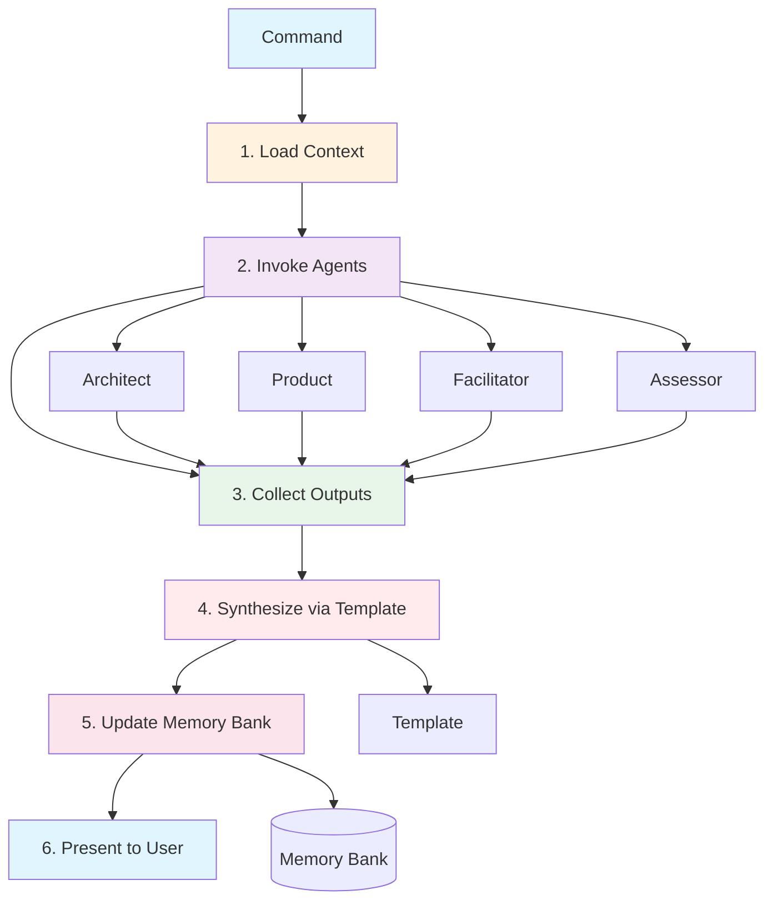

# Command Orchestration Pattern

**Version**: 1.0
**Last Updated**: 2025-11-03
**Status**: Active
**Source**: TASK-003 - Command Orchestration Pattern Refactor

---

## Overview

The **Command Orchestration Pattern** is CCFlow's architectural pattern for coordinating workflow agents, synthesizing results, and maintaining memory bank consistency. It establishes clear separation between orchestration (commands), analysis (agents), and synthesis (templates).

**Core Principle**: Commands orchestrate, agents analyze, templates structure, memory bank persists.

This pattern has been successfully applied to three core CCFlow commands (`/cf:plan`, `/cf:creative`, `/cf:feature`) and proven across different workflow types (planning, creative exploration, task creation).

---

## Pattern Architecture



---

## The Six-Step Flow

### Step 1: Load Context

**Purpose**: Commands read memory bank files to understand current project state.

**Implementation**:
```markdown
## Step 1: Load Context

Read memory bank files (parallel when possible):
- tasks.md - Understand existing work and task IDs
- activeContext.md - Current project focus
- systemPatterns.md - Technical patterns (if exists)
- productContext.md - Product features (if exists)
- CLAUDE.md - Tech stack reference (if exists)

Extract context:
- Next available task ID (highest TASK-NNN + 1)
- Current project focus
- Existing patterns that might apply
- Tech stack for scope estimation
```

**Why Important**: Agents need context to provide relevant analysis. Commands load once and pass to all agents.

---

### Step 2: Invoke Agents

**Purpose**: Engage specialized workflow agents for domain-specific analysis.

**Implementation Pattern**:
```markdown
## Step 2: Invoke Agents

Task(
  subagent_type="architect",
  description="Technical Analysis",
  prompt=`
    Analyze technical approach for [context].

    **Context**:
    - Current State: [from memory bank]
    - Requirements: [user input]
    - Tech Stack: [from CLAUDE.md]

    **Analysis Required**:
    1. [Analysis area 1]
    2. [Analysis area 2]

    **Output Format**:
    - [Structured output expectations]

    Architect: Provide technical analysis.
    Do NOT create task entries or update memory bank (command handles this).
  `
)

Task(
  subagent_type="product",
  description="Requirements Analysis",
  prompt=`
    [Similar structure for product analysis]
  `
)
```

**Invocation Strategies**:
- **Parallel**: Multiple agents invoked concurrently (default for performance)
- **Sequential**: Agents invoked one after another (when output depends on previous)
- **Conditional**: Agents invoked based on flags (e.g., `--interactive` triggers facilitator)

**Agent Constraint**: Each agent invoked **once** per workflow (no agent re-invocation loops).

---

### Step 3: Collect Outputs

**Purpose**: Gather analysis from all invoked agents.

**Implementation**:
```markdown
## Step 3: Collect Outputs

**Architect returns**:
- Technical approach
- Component breakdown
- Risk assessment
- Implementation phases

**Product returns**:
- User value statement
- Acceptance criteria
- Edge cases
- Non-functional requirements

**Facilitator returns** (if interactive):
- Clarifying questions
- Gap identifications
- User answers collected
```

**Output Handling**:
- Commands receive all agent outputs as structured data
- No agent sees other agents' outputs (separation of concerns)
- Command is responsible for integration logic

---

### Step 4: Synthesize via Template

**Purpose**: Structure agent outputs into coherent results using templates.

**Implementation Pattern**:
```markdown
## Step 4: Synthesize Using Template

**Read template**:
```
.claude/templates/workflow/[command]-template.md
```

**Apply synthesis logic**:

**Section 1** (from agent A):
- [Agent A's analysis structured into section]

**Section 2** (from agent B):
- [Agent B's analysis structured into section]

**Synthesis Section** (command logic):
- [Integration of both perspectives]
- [Identification of tensions or alignments]
- [Strategic recommendations]
```

**Template Characteristics**:
- **Separate files**: Templates live in `.claude/templates/workflow/`
- **Markdown format**: Human-readable structure with placeholder sections
- **Reusable**: Same template used across multiple invocations
- **Versioned**: Templates include version numbers for tracking changes

---

### Step 5: Update Memory Bank

**Purpose**: Persist synthesized results systematically to memory bank.

**Implementation Pattern**:
```markdown
## Step 5: Update Memory Bank

**Update tasks.md**:
Add task entry with synthesized details:
```markdown
### ⏳ TASK-[ID]: [Task Name] (Level [1-4])

**Status**: [Pending/Active]
**Complexity**: Level [1-4]
**Created**: [YYYY-MM-DD]

**Description**: [From user + agents]

**User Value**: [From product agent]

**Acceptance Criteria**: [From product agent]

**Technical Approach**: [From architect agent]
```

**Update activeContext.md**:
Add to Recent Changes:
```markdown
### [YYYY-MM-DD HH:MM] - [Activity]
**Agent**: [Agents involved]
**Task ID**: TASK-[ID]
**Decision**: [Key decision made]
**Next Action**: [Recommended command]
```
```

**Update Strategy**:
- **Atomic updates**: Update all files in single operation
- **Cross-file consistency**: Ensure no contradictions across memory bank
- **Timestamp tracking**: Document when changes occurred
- **Decision logging**: Capture why choices were made

---

### Step 6: Present to User

**Purpose**: Communicate synthesized output in structured, actionable format.

**Implementation Pattern**:
```markdown
## Step 6: Present to User

🎯 [RESULT TYPE]: [Title]

## [Section 1 Heading]

**[Subsection]**: [Content from synthesis]

---

### 📊 MEMORY BANK

✓ tasks.md updated ([what changed])
✓ activeContext.md updated ([what changed])

---

### ⏭️ NEXT STEP

→ **RECOMMENDATION**: [Clear next action]

**Proceed with**:
```bash
[Next command to run]
```

[Why this routing makes sense]
```

**Output Characteristics**:
- **Structured**: Clear sections with visual hierarchy
- **Actionable**: Explicit next steps provided
- **Complete**: All decisions documented
- **Traceable**: Links to memory bank updates

---

## Roles and Responsibilities

### Command Layer

**Responsibilities**:
- Context loading from memory bank
- Agent invocation with appropriate context
- Output collection from all agents
- Template-based synthesis (integration logic)
- Memory bank updates (systematic)
- User communication (structured output)

**Tools Available**: All tools (Read, Write, Edit, Task, Bash, etc.)

**Characteristics**:
- Contains orchestration logic
- Contains synthesis logic (how to integrate agent outputs)
- Contains routing logic (next command recommendations)
- **Does NOT contain domain analysis** (that's agent responsibility)

---

### Workflow Agent Layer

**Responsibilities**:
- Domain-specific analysis (technical, product, quality, etc.)
- Recommendations within domain expertise
- Questions to clarify requirements (facilitator specifically)
- Risk identification and assessment

**Tools Available**: Read, Grep, Glob (read-only access)

**Characteristics**:
- **Analysis only**: Provide insights and recommendations
- **No synthesis**: Don't combine with other agents' outputs
- **No memory updates**: Don't write to memory bank directly
- **No orchestration**: Don't invoke other agents
- **Single invocation**: Each agent called once per workflow

**Agent Types**:
| Agent | Domain | Output Type |
|-------|--------|-------------|
| Architect | Technical design | Approaches, components, risks |
| Product | User requirements | Value, criteria, edge cases |
| Assessor | Complexity analysis | Levels, scope, routing |
| Facilitator | Interactive refinement | Questions only (no answers) |
| Documentarian | Memory bank consistency | Validation, suggestions |
| Reviewer | Quality validation | Issues, risks, improvements |

---

### Facilitator Special Role

**Unique Characteristics**:
- **Questions ONLY**: Never provides answers, recommendations, or synthesis
- **Human-in-the-loop**: Enables interactive refinement via structured questioning
- **No direct agent invocation**: Parent command handles agent coordination
- **No memory updates**: Parent command handles after facilitation complete

**Pattern Position**: Facilitator is the **clarification layer** in orchestration pipeline:
- Commands orchestrate workflows
- Agents provide analysis
- **Facilitator provides questions**
- Commands synthesize all inputs

**Why Specialized**: Maintaining question-only discipline ensures facilitator doesn't blur into synthesis role, which is command's responsibility.

---

### Template Layer

**Responsibilities**:
- Structure definition for outputs
- Placeholder sections for agent inputs
- Synthesis section guidelines
- Consistent formatting across invocations

**Location**: `.claude/templates/workflow/[template-name].md`

**Template Naming**: `[command-name]-template.md` (e.g., `checkpoint-template.md`, `creative-spec-template.md`)

**Version Control**: Templates include version numbers and changelog for tracking

---

## Implementation Examples

### Example 1: Planning Command (/cf:plan)

**Workflow**: Parallel agent invocation with synthesis

**Agents Used**: Architect (technical approach) + Product (user value) + Facilitator (if `--interactive`)

**Template**: `checkpoint-template.md`

**Data Flow**:
```
/cf:plan TASK-005
  ↓
Step 1: Load context (tasks.md → TASK-005 details)
  ↓
Step 2: Invoke agents (parallel)
  ├─→ Architect: Technical breakdown
  └─→ Product: User value validation
  ↓
Step 3: Collect outputs
  ├─→ Architect: Components, phases, risks
  └─→ Product: Acceptance criteria, edge cases
  ↓
Step 4: Synthesize via checkpoint-template.md
  ├─→ Technical Plan (from Architect)
  ├─→ User Value (from Product)
  └─→ Implementation Phases (integrated)
  ↓
Step 5: Update memory bank
  ├─→ tasks.md: Add sub-tasks
  └─→ activeContext.md: Log planning session
  ↓
Step 6: Present plan to user
  ├─→ Structured implementation plan
  └─→ Next action: /cf:code [first sub-task]
```

**Result**: Actionable implementation plan with technical and product perspectives integrated.

---

### Example 2: Creative Command (/cf:creative)

**Workflow**: Sequential interactive invocation with human-in-the-loop

**Agents Used**: Facilitator (questions) → Architect (technical) → Product (user) → Facilitator (synthesis questions)

**Template**: `creative-spec-template.md`

**Data Flow**:
```
/cf:creative "design caching system"
  ↓
Step 1: Load context (systemPatterns.md → existing patterns)
  ↓
Step 2: Invoke Facilitator
  ├─→ Phase 1: Problem Definition (questions)
  ├─→ User responds
  ├─→ Phase 2: Invoke Architect + Product
  ├─→ Phase 3: User selects approach (questions)
  ↓
Step 3: Collect outputs
  ├─→ Problem definition (user answers)
  ├─→ Architect: 3 technical approaches
  ├─→ Product: User implications for each
  └─→ User: Selected approach + rationale
  ↓
Step 4: Synthesize via creative-spec-template.md
  ├─→ Problem Statement
  ├─→ Solution Approaches (all 3)
  ├─→ Selected Approach (user's choice)
  ├─→ Implementation Specification
  └─→ Patterns Extracted (if reusable 3+)
  ↓
Step 5: Update memory bank
  ├─→ activeContext.md: Creative session logged
  ├─→ systemPatterns.md: New patterns added
  └─→ tasks.md: Implementation approach documented
  ↓
Step 6: Present specification to user
  ├─→ Complete design specification
  └─→ Next action: /cf:plan [task-id] or /cf:code [task-id]
```

**Result**: Design specification with multiple perspectives, user-selected approach, and reusable patterns.

---

### Example 3: Feature Command (/cf:feature)

**Workflow**: Dual-agent coordination with routing

**Agents Used**: Assessor (complexity) + Product (requirements)

**Template**: `feature-task-template.md`

**Data Flow**:
```
/cf:feature "add user authentication"
  ↓
Step 1: Load context (tasks.md → next ID)
  ↓
Step 2: Invoke agents (parallel)
  ├─→ Assessor: Complexity analysis
  └─→ Product: Acceptance criteria
  ↓
Step 3: Collect outputs
  ├─→ Assessor: Level 2, ~5 files, routing → /cf:plan
  └─→ Product: 5 acceptance criteria, 3 edge cases
  ↓
Step 4: Synthesize via feature-task-template.md
  ├─→ Task Header (ID, complexity, status)
  ├─→ Description (user's request)
  ├─→ User Value (from Product)
  ├─→ Acceptance Criteria (from Product)
  ├─→ Complexity Details (from Assessor)
  └─→ Routing Recommendation (from Assessor)
  ↓
Step 5: Update memory bank
  ├─→ tasks.md: New TASK-[ID] entry created
  └─→ activeContext.md: Task creation logged
  ↓
Step 6: Present task summary to user
  ├─→ Task details (all synthesized info)
  └─→ Next action: /cf:plan TASK-[ID] (Level 2+)
                  OR /cf:code TASK-[ID] (Level 1)
```

**Result**: Structured task entry with complexity routing and acceptance criteria.

---

## Pattern Benefits

### 1. Clear Separation of Concerns

**Commands**:
- Orchestrate workflows
- Synthesize results
- Update memory bank
- Communicate to user

**Agents**:
- Analyze within domain
- Recommend approaches
- Identify risks
- **Never** synthesize or orchestrate

**Templates**:
- Structure outputs
- Ensure consistency
- Guide synthesis

**Outcome**: Each layer has single responsibility, making system easier to understand and maintain.

---

### 2. Facilitator Role Clarity

**Before Orchestration Pattern**:
- Facilitator sometimes synthesized
- Confusion about when to ask vs tell
- Overlap with command synthesis

**After Orchestration Pattern**:
- Facilitator **only** asks questions
- Commands handle all synthesis
- Clear boundary: questions (facilitator) vs answers (user/agents) vs synthesis (command)

**Outcome**: No more role confusion, predictable facilitation behavior.

---

### 3. Template-Driven Consistency

**Benefits**:
- Same structure across invocations
- Predictable output format
- Easy to validate completeness
- Reusable across commands

**Example**:
- `/cf:plan` always produces same plan structure (via checkpoint-template.md)
- `/cf:creative` always produces same spec structure (via creative-spec-template.md)
- Users know what to expect

**Outcome**: High-quality, consistent documentation and outputs.

---

### 4. Parallel Execution

**Pattern Supports**:
- Multiple agents invoked concurrently
- Reduces total execution time
- Scales to additional agents

**Example**:
```markdown
# Parallel invocation (default)
Task(architect, "...") + Task(product, "...") → Both run concurrently
```

**Outcome**: Faster workflows without sacrificing quality.

---

### 5. Memory Bank Integrity

**Pattern Ensures**:
- Systematic updates (not ad-hoc)
- Cross-file consistency
- Decision traceability
- Timestamp tracking

**Anti-pattern Prevented**:
- Agents updating memory bank directly (causes conflicts)
- Missing cross-file updates (causes inconsistencies)
- Lost decision rationale (causes confusion later)

**Outcome**: Trustworthy project memory across sessions.

---

### 6. Testability

**Separation Enables**:
- Test agent analysis independently
- Test command orchestration independently
- Test synthesis logic independently
- Test template structure independently

**Validation Approach**:
- Manual testing with real roadmap features (dogfooding)
- Integration validation (full command → agents → synthesis → memory flow)
- Template validation (structure completeness)
- Memory bank consistency checks

**Outcome**: Easier to validate pattern compliance and catch regressions.

---

## Pattern Trade-offs

### ⚠️ Template Maintenance

**Issue**: Templates need updates when output structure changes.

**Mitigation**:
- Version templates (track changes)
- Keep templates simple (minimal structure)
- Reuse where possible (don't create unnecessary templates)

---

### ⚠️ Commands Become Longer

**Issue**: Orchestration logic adds lines to command files.

**Mitigation**:
- Worth it for clarity and consistency
- Refactor common patterns into reusable sections
- Use clear step-by-step structure for readability

---

### ⚠️ Initial Complexity

**Issue**: Pattern requires understanding of orchestration flow.

**Mitigation**:
- Comprehensive documentation (this file!)
- Examples in codebase (3 commands refactored)
- Clear step-by-step implementation guide

---

### ⚠️ Synthesis Logic in Commands

**Issue**: Commands contain domain logic (synthesis rules).

**Acceptance**:
- Commands are **orchestration + synthesis layer** by design
- Synthesis = "how to integrate agent outputs" (command responsibility)
- Analysis = "what to recommend" (agent responsibility)
- Clear boundary between the two

---

## When to Use This Pattern

### ✅ Use When

1. **Multi-agent coordination**: Command needs input from 2+ workflow agents
2. **Synthesis required**: Outputs from multiple agents must be integrated
3. **Memory bank updates**: Systematic updates to memory bank files needed
4. **Structured outputs**: Template-driven consistency valuable
5. **Interactive workflows**: Human-in-the-loop facilitation needed

**Examples**: Planning commands, creative exploration, task creation, checkpoint workflows

---

### ❌ Don't Use When

1. **Single agent**: Command only needs one agent (no orchestration needed)
2. **Read-only**: Command only reads data (no synthesis required)
3. **Fixed output**: No template flexibility needed
4. **Performance-critical**: Overhead matters (rare in CCFlow)

**Examples**: Simple status queries, file reads, basic routing commands

---

## Antipatterns to Avoid

### ❌ Agent Synthesis

**Problem**: Agents synthesizing other agents' outputs

**Why Bad**: Violates separation of concerns, creates dependency between agents

**Solution**: Commands handle all synthesis

---

### ❌ Facilitator Analysis

**Problem**: Facilitator providing recommendations or synthesis

**Why Bad**: Blurs facilitator's question-only role, creates confusion

**Solution**: Facilitator asks questions, commands/agents provide answers

---

### ❌ Skipping Templates

**Problem**: Ad-hoc formatting instead of templates

**Why Bad**: Defeats consistency goal, variable quality

**Solution**: Always use templates from `.claude/templates/workflow/`

---

### ❌ Sequential Agent Invocation (Unnecessary)

**Problem**: Invoking agents one-by-one when they could run in parallel

**Why Bad**: Slower execution, no performance benefit

**Solution**: Use parallel Task() calls unless sequential dependency exists

---

### ❌ Embedded Templates

**Problem**: Template structure embedded in command file

**Why Bad**: Not reusable, harder to maintain, violates separation

**Solution**: Templates must be separate files in `.claude/templates/workflow/`

---

### ❌ Memory Bank Chaos

**Problem**: Ad-hoc memory bank updates without synthesis

**Why Bad**: Inconsistencies across files, lost decisions, conflicts

**Solution**: Always update systematically using synthesis output

---

## Migration Guide

### Refactoring Existing Commands to Orchestration Pattern

**Step 1: Identify Current Structure**
- What agents does command invoke?
- What synthesis does command perform?
- What memory bank updates does command make?

**Step 2: Create Template** (if needed)
- Extract output structure
- Create `.claude/templates/workflow/[command]-template.md`
- Define placeholder sections for agent inputs

**Step 3: Refactor Command File**
- Add 6-step structure (Load → Invoke → Collect → Synthesize → Update → Present)
- Move agent invocations to Step 2
- Move synthesis to Step 4 (using template)
- Move memory updates to Step 5

**Step 4: Update Agent Constraints**
- Add "Do NOT create task entries or update memory bank" to agent prompts
- Ensure agents only analyze (no synthesis)
- Ensure facilitator only questions (no answers)

**Step 5: Add Orchestration Notes**
- Document pattern compliance
- Document agent responsibilities
- Document command responsibilities

**Step 6: Test**
- Manual test with real feature
- Validate 100% pattern compliance
- Verify memory bank consistency

---

## Pattern Validation Checklist

Use this checklist to validate pattern compliance:

### ✅ Context Loading
- [ ] Command reads memory bank files for context
- [ ] Context passed to agents via prompt
- [ ] No redundant context loading by agents

### ✅ Agent Invocation
- [ ] Agents invoked via Task() calls
- [ ] Parallel invocation when possible
- [ ] Agent constraints documented ("Do NOT update memory bank")

### ✅ Output Collection
- [ ] Command collects all agent outputs
- [ ] Outputs structured and organized
- [ ] No agent sees other agents' outputs

### ✅ Template Synthesis
- [ ] Template file exists in `.claude/templates/workflow/`
- [ ] Template properly referenced in command
- [ ] Synthesis logic applied to integrate outputs

### ✅ Memory Bank Updates
- [ ] Systematic updates (not ad-hoc)
- [ ] Cross-file consistency maintained
- [ ] Decision rationale documented

### ✅ User Communication
- [ ] Structured output presented
- [ ] Clear next steps provided
- [ ] Memory bank updates confirmed

### ✅ Documentation
- [ ] Orchestration Notes section present
- [ ] Command responsibilities documented
- [ ] Agent responsibilities documented
- [ ] Examples comprehensive

---

## Related Patterns

### Template-Driven Synthesis
- Commands use templates for consistent structure
- Templates live in `.claude/templates/workflow/`
- Reusable across multiple invocations

### Parallel Agent Invocation
- Multiple Task() calls in single command step
- Reduces total execution time
- Scales to additional agents

### Memory Bank Update Protocol
- Systematic approach to memory bank modifications
- Cross-file consistency validation
- Decision traceability

### Facilitator as Question Broker
- Supports interactive refinement without synthesis
- Pure human-in-the-loop gateway
- Commands handle synthesis after facilitation

---

## Pattern Evolution

### Current Status (v1.0)

**Commands Refactored**: 3 of 12 (25%)
- ✅ `/cf:plan` (L2/L3/L4 variants)
- ✅ `/cf:creative`
- ✅ `/cf:feature`

**Templates Created**: 3
- ✅ `checkpoint-template.md`
- ✅ `creative-spec-template.md`
- ✅ `feature-task-template.md`

**Pattern Universality**: ✅ Proven across planning, creative, and feature workflows

---

### Future Roadmap

**Phase 5 (Next)**: Systematic adoption across remaining commands
- `/cf:code` - Implementation orchestration
- `/cf:review` - Quality validation orchestration
- `/cf:checkpoint` - Memory bank synthesis orchestration

**Phase 6**: Pattern optimization
- Performance profiling
- Template consolidation (where appropriate)
- Synthesis logic refactoring

---

## References

- **Pattern Definition**: `memory-bank/systemPatterns.md:409-582`
- **Template Usage Guide**: `docs/workflows/template-usage.md`
- **Facilitator Pattern**: `docs/workflows/facilitator-pattern.md`
- **Agent Organization**: `docs/architecture/agent-organization.md`
- **Commands Reference**: `docs/commands/README.md`

---

**Document Version**: 1.0
**Created**: 2025-11-03 (TASK-003-11)
**Pattern Source**: TASK-003 - Command Orchestration Pattern Refactor
