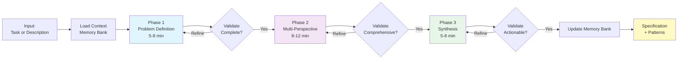

# /cf:creative - Multi-Perspective Creative Problem-Solving

**Category**: Workflow Execution
**Purpose**: Structured creative exploration for high-complexity challenges through multi-perspective analysis
**Complexity**: Level 3-4 problems requiring deep analysis before implementation

---

## Quick Reference

```bash
/cf:creative [task-id|description]
```

**When to Use**:
- Complex problems (Level 3-4) without obvious solutions
- Ambiguous requirements needing exploration
- Multiple valid approaches requiring systematic evaluation
- Novel challenges outside established patterns
- Significant trade-offs needing structured analysis

**Duration**: 18-28 minutes (interactive session)

**Output**: Implementation-ready specification + reusable patterns

---

## Overview

`/cf:creative` enables structured multi-perspective exploration for problems too complex or ambiguous for standard planning. Through a 3-phase interactive process (Problem Definition → Multi-Perspective Analysis → Synthesis), it generates implementation-ready specifications and extracts reusable patterns.

**Core Philosophy**: Some problems need exploration before planning. Creative sessions reduce implementation risk and improve decision confidence through systematic multi-perspective analysis.

---

## Command Syntax

### Basic Usage

```bash
# With existing task ID
/cf:creative TASK-005

# With problem description
/cf:creative "design real-time collaboration system"

# With complex description
/cf:creative "We need file uploads but unsure if S3, local storage, or CDN is best"
```

### Parameters

- **`[task-id]`**: Existing task from tasks.md (e.g., TASK-005)
  - Command loads task context automatically
  - Uses task description as problem seed
  - Updates task notes with specification

- **`[description]`**: Free-form problem description
  - Direct problem exploration without task
  - Useful for early-stage ideation
  - Can create task afterward with `/cf:feature`

**Note**: At least one parameter required.

---

## Process: 3-Phase Creative Session



### Phase 1: Problem Definition (5-8 minutes)

**Goal**: Deeply understand the problem before exploring solutions

**Process**:
1. Facilitator presents problem context from memory bank
2. Interactive questions explore:
   - Core problem and failure scenarios
   - Technical, business, and resource constraints
   - Success criteria and edge cases
3. User provides responses
4. Facilitator synthesizes refined problem statement
5. **Validation gate**: User confirms understanding or requests refinement

**Output**: Clear problem statement with requirements, constraints, success criteria

### Phase 2: Multi-Perspective Analysis (8-12 minutes)

**Goal**: Generate 3 distinct perspectives, identify convergences and tensions

**Perspectives**:
1. **Architect**: Technical approach, components, integration patterns, risks
2. **Product**: User needs, UX flow, acceptance criteria, edge cases
3. **Tech Stack**: Stack-specific patterns, framework integration, performance

**Process**:
1. Facilitator reads architect.md and product.md for authentic perspectives
2. Generates each perspective with trade-off analysis
3. Cross-perspective analysis:
   - **Convergent insights**: Where perspectives agree
   - **Productive tensions**: Where perspectives disagree (revealing trade-offs)
4. **Validation gate**: User confirms perspectives are comprehensive

**Output**: 3 detailed perspectives + convergence/tension analysis

### Phase 3: Synthesis (5-8 minutes)

**Goal**: Integrate insights, resolve tensions, produce actionable specification

**Process**:
1. Recommended approach with rationale
2. How it resolves identified tensions
3. Component breakdown and implementation phases
4. Data flow and testing strategy
5. Pattern extraction (if reusable in 3+ scenarios)
6. Decision record with alternatives and trade-offs
7. **Validation gate**: User confirms specification is actionable

**Output**: Implementation specification + patterns + decision record

---

## Examples

### Example 1: Task-Based Session

**Input**:
```bash
/cf:creative TASK-005
```

**Scenario**: TASK-005 is "Implement real-time collaboration" (Level 3)

**Session Flow**:
```
🔍 PHASE 1: PROBLEM DEFINITION
━━━━━━━━━━━━━━━━━━━━━━━━━━━━━━

Problem: Enable multiple users to edit shared documents simultaneously

[Interactive questions about:]
- Conflict resolution approach?
- User experience during conflicts?
- Scale requirements?
- Latency tolerance?

[User responds]

Problem Understanding (Refined):
- Core: Real-time collaborative editing with conflict-free merges
- Must have: Sub-second updates, automatic conflict resolution
- Constraints: <100ms latency, handle 10 concurrent users
- Success: No lost edits, clear conflict visualization

✓ Validated

🎨 PHASE 2: MULTI-PERSPECTIVE ANALYSIS
━━━━━━━━━━━━━━━━━━━━━━━━━━━━━━━━━━

ARCHITECT Perspective:
- WebSocket layer for real-time updates
- Operational Transformation OR CRDT for conflict resolution
- Risk: OT complexity vs CRDT learning curve

PRODUCT Perspective:
- User presence indicators (who's editing where)
- Conflict highlighting in UI
- Edge case: Network interruption recovery

TECH STACK Perspective:
- Socket.io for WebSocket abstraction
- Yjs library (mature CRDT implementation)
- Performance: CRDT memory overhead acceptable for <10 users

Cross-Perspective Analysis:
Convergent: WebSocket necessary, conflict resolution critical
Tensions: OT (complex, proven) vs CRDT (simpler, newer)

✓ Validated

🧩 PHASE 3: SYNTHESIS
━━━━━━━━━━━━━━━━━━━

Recommended Approach: Hybrid CRDT (Yjs) + custom conflict UI

Rationale:
- CRDT (Yjs) reduces implementation complexity
- Custom UI addresses Product's UX concerns
- Proven library mitigates Architect's risk concerns

Component Breakdown:
1. WebSocket Manager (Socket.io wrapper)
2. CRDT Document Store (Yjs integration)
3. Presence Service (user tracking)
4. Conflict UI Component (visual feedback)

Testing Strategy:
- Unit: CRDT operations isolated
- Integration: Multi-client scenarios
- Edge: Network interruption, simultaneous edits

Pattern Extracted: "Real-Time Collaboration Pattern"
- Context: Multi-user document editing
- Solution: CRDT + WebSocket + Presence
- Reusability: Chat, whiteboard, form collaboration

✓ Validated

✅ CREATIVE SESSION COMPLETE
Duration: 23 minutes
Patterns: 1 added to pattern catalog
Next: /cf:plan TASK-005
```

### Example 2: Description-Based Session

**Input**:
```bash
/cf:creative "We need file uploads but unsure if S3, local storage, or CDN is best"
```

**Session Flow**:
```
🔍 PHASE 1: PROBLEM DEFINITION

[Explores requirements:]
- File sizes and volumes?
- Security requirements?
- Budget constraints?
- Geographic distribution?

[User clarifies scale and cost sensitivity]

🎨 PHASE 2: MULTI-PERSPECTIVE ANALYSIS

ARCHITECT: S3 + CloudFront hybrid minimizes server load
PRODUCT: Direct upload avoids timeout issues for large files
TECH STACK: Presigned URLs for secure direct upload

Tensions: Cost (CDN premium) vs UX (faster delivery)

🧩 PHASE 3: SYNTHESIS

Recommended: S3 direct upload + CloudFront for frequently accessed

Pattern: "Hybrid Storage Pattern" extracted
- Context: User-uploaded files with variable access patterns
- Solution: Object storage + CDN for hot files
- Benefits: Scalability + cost optimization

Next: Create task via /cf:feature, then /cf:plan for implementation
```

---

## Memory Bank Integration

### Files Read (Context Loading)

- `projectbrief.md` - Project constraints and scope
- `systemPatterns.md` - Existing patterns to reference
- `activeContext.md` - Current work focus
- `tasks.md` - Task details if task-id provided
- `productContext.md` - User needs and features

### Files Updated (After Session)

**activeContext.md**:
```markdown
### [YYYY-MM-DD HH:MM] - Creative Session Complete: [Task/Topic]
**Session Type**: Multi-perspective creative exploration
**Duration**: [X] minutes
**Perspectives**: Architect, Product, Tech Stack
**Problem Explored**: [One-line statement]
**Solution Designed**: [Approach name]
**Patterns Created**: [N] patterns added
**Next Action**: /cf:plan TASK-ID or /cf:code TASK-ID
```

**Pattern Catalog** (if patterns extracted):

1. **Create pattern file**: `memory-bank/patterns/[pattern-name].md`
   - Copy template from `.claude/templates/pattern-template.md`
   - Fill all sections (Context, Problem, Solution, Benefits, Trade-offs, etc.)

2. **Update master index**: `memory-bank/systemPatterns.md`
   - Add to appropriate category table (Workflow/Architectural/Technical)
   - Link: `[Pattern Name](./patterns/pattern-name.md) | Purpose | Active`

**tasks.md** (if task exists):
```markdown
**Creative Session**: ✅ Complete [Date]
- Implementation approach validated
- Patterns extracted: [names]
- Ready for: /cf:plan or /cf:code
**Implementation Notes**: [From synthesis]
**Patterns to Apply**: [Pattern names]
```

---

## Integration with CCFlow Workflow

### Typical Flow

```mermaid
graph LR
    F[/cf:feature] --> A[Assessor]
    A -->|Level 3-4<br/>High Ambiguity| CR[/cf:creative]
    CR --> SP[Specification<br/>+ Patterns]
    SP --> P[/cf:plan]
    P --> C[/cf:code]

    A -->|Level 2-3<br/>Clear Scope| P

    style CR fill:#fff3e0
    style SP fill:#fff9c4
    style P fill:#f3e5f5
    style C fill:#e8f5e9
```

### When to Use Creative vs Plan

| Situation | Use `/cf:creative` | Use `/cf:plan` |
|-----------|-------------------|----------------|
| **Clarity** | Multiple valid approaches, unclear which is best | Single clear approach, just needs breakdown |
| **Complexity** | Level 3-4 with high uncertainty | Level 2-3 with established patterns |
| **Novelty** | Novel challenges outside existing patterns | Similar to previous implementations |
| **Trade-offs** | Significant trade-offs needing analysis | Straightforward decisions |
| **Time** | Can invest 20-30 min upfront | Need to move quickly |

**Rule of Thumb**: If you're debating which approach to take, use `/cf:creative`. If you know the approach and just need to plan execution, use `/cf:plan`.

---

## Common Patterns

### When Assessor Might Recommend (Future)

Currently manual invocation only. Future enhancement will enable Assessor to detect:
- Ambiguity indicators in task description ("unsure", "maybe", "which approach")
- Multiple valid approaches mentioned
- Novel challenges identified
- User explicitly requests exploration

### Follow-Up Actions

After creative session:

1. **Standard route**: `/cf:plan [task-id]` → detailed implementation plan
2. **Simple enough**: `/cf:code [task-id]` → implement directly if specification is clear
3. **Create task first**: `/cf:feature "[description]"` if no task exists yet

---

## Error Handling

### Memory Bank Not Initialized
```
❌ Memory bank not found

The memory-bank/ directory does not exist.

Initialize CCFlow project: /cf:init
```

**Fix**: Run `/cf:init` to create memory bank structure

### Missing Task ID
```
❌ Task [task-id] not found in tasks.md

Create task first: /cf:feature [description]
Or provide description: /cf:creative "your problem description"
```

**Fix**: Create task with `/cf:feature` or provide description directly

### No Input Provided
```
❌ No input provided

Usage: /cf:creative [task-id|description]

Examples:
  /cf:creative TASK-003
  /cf:creative "design real-time collaboration system"
```

**Fix**: Provide either task ID or description

### Low Complexity Task Warning
```
⚠️ Task [task-id] is Level [1-2]

Creative sessions are designed for complex problems (Level 3-4).

For Level 1-2 tasks, consider:
  /cf:plan [task-id] → Standard planning
  /cf:code [task-id] → Direct implementation

Continue with creative session anyway? [yes/no]
```

**Guidance**: Creative sessions have 20-30 min overhead. For simple tasks, standard planning is more efficient.

---

## Best Practices

### When to Use

✅ **Good Uses**:
- Novel architectural challenges
- Multiple competing approaches with unclear winner
- High-stakes decisions with significant trade-offs
- Ambiguous requirements needing structured exploration
- Complex integrations outside established patterns

❌ **Poor Uses**:
- Simple CRUD operations
- Well-established patterns (use existing systemPatterns.md)
- Time-sensitive bug fixes
- Problems already explored in previous sessions

### Session Preparation

**Before starting**:
1. Review existing patterns in systemPatterns.md
2. Check if similar problems solved before
3. Ensure you have 20-30 minutes available
4. Prepare to participate actively (validation gates require input)

**During session**:
1. Answer facilitator questions thoughtfully
2. Challenge perspectives if they miss important aspects
3. Validate each phase carefully before proceeding
4. Ask for refinement if analysis feels incomplete

**After session**:
1. Review specification in activeContext.md
2. Proceed to `/cf:plan` or `/cf:code` while context is fresh
3. Reference extracted patterns during implementation

### Pattern Quality

**Good patterns** (extracted to pattern catalog):
- Reusable in 3+ scenarios
- Clear context and problem statement
- Concrete solution with benefits and trade-offs
- Validated through synthesis phase

**Skip extraction** when:
- Pattern is too project-specific
- Only 1-2 potential use cases
- Already exists in pattern catalog
- Too abstract to be actionable

---

## Related Commands

- **`/cf:feature`** - Create tasks that may need creative exploration
- **`/cf:plan`** - Standard planning after creative session (typical next step)
- **`/cf:facilitate`** - Interactive refinement and validation (used internally)
- **`/cf:code`** - Implementation after specification complete
- **`/cf:checkpoint`** - Save creative session outputs to memory bank

---

## Technical Details

### Agent Orchestration

**Primary Agent**: facilitator (`.claude/agents/workflow/facilitator.md`)
**Mode**: Mode 3 - Creative Session

**Facilitator reads**:
- `.claude/agents/workflow/architect.md` for technical analysis approach
- `.claude/agents/workflow/product.md` for user needs analysis approach
- `CLAUDE.md` for tech stack details
- `memory-bank/systemPatterns.md` for established patterns

**Tools Used**:
- **Read**: Load memory bank files and agent specifications
- **Edit**: Update memory bank after session
- **Task**: (Reserved for future sub-agent delegation)

### Validation Gates

Each phase requires explicit user confirmation:
- **Phase 1 → Phase 2**: Problem understanding validated
- **Phase 2 → Phase 3**: Perspectives comprehensive and accurate
- **Phase 3 → Complete**: Specification actionable for implementation

**Cannot be automated** - interactive participation is core to creative exploration.

---

## Limitations & Future Enhancements

### Current Limitations (MVP v1.0)

- **Manual invocation only**: Assessor auto-routing deferred to Phase 2
- **3 perspectives**: Architect, Product, Tech Stack (additional perspectives deferred)
- **Single output format**: Specification only (report mode deferred)
- **No 4th phase**: Detailed design refinement deferred

### Planned Enhancements

**Phase 2** (Future):
- Assessor auto-routing based on ambiguity detection
- Additional perspective templates (Security, Performance, etc.)
- `--output-format` flag for report vs specification mode
- Sequential MCP integration for deeper reasoning

**Phase 3** (Future):
- 4th phase: Detailed design with diagrams and pseudocode
- Pattern library search before generating new patterns
- Multi-session creative workflows for very large problems

---

## FAQ

**Q: How is this different from `/cf:plan`?**
A: `/cf:plan` assumes you know the approach and need to break it down. `/cf:creative` helps you *decide* the approach through multi-perspective analysis.

**Q: Can I skip phases?**
A: No. Each phase builds on previous phases. Problem definition is required before analysis, analysis before synthesis.

**Q: What if I don't know the answers to facilitator questions?**
A: That's valuable information! Identifying unknowns is part of problem definition. Facilitator will note these as "Known Unknowns" requiring research.

**Q: Can I use this for non-technical problems?**
A: Currently optimized for technical problems (Architect + Tech Stack perspectives). Future versions may support other domains.

**Q: How do I know if a pattern is reusable?**
A: If you can identify 3+ distinct scenarios where the pattern applies, it's worth extracting. Facilitator validates reusability during synthesis.

**Q: What if the session reveals the problem needs more research?**
A: Creative sessions can conclude with "Needs Research" next action. This is valid output - better to discover knowledge gaps before implementation.

---

**Command Specification**: `.claude/commands/cf/creative.md`
**Version**: 1.0 (MVP - 3 Phase)
**Last Updated**: 2025-10-28
**Status**: Active (Phase 1 implementation)
