# /cf:feature - Intelligent Feature Assessment & Specification

**Category**: Workflow Execution
**Purpose**: Complexity-aware feature assessment with conditional expert analysis for specification completeness
**Complexity**: All levels (L1-L4) with adaptive orchestration

---

## Quick Reference

```bash
/cf:feature [description]
```

**When to Use**:
- Creating new features or enhancements
- Need complexity assessment before planning
- Want specification completeness (avoid mid-implementation spec pauses)
- Entry point for all new work

**Duration**:
- Level 1 (Simple): 2-4 minutes
- Level 2+ (Complex): 8-12 minutes (includes technical pre-analysis)

**Output**: Task specification with complexity routing and complete acceptance criteria

---

## Overview

`/cf:feature` is the intelligent entry point for all new work in CCFlow. It performs complexity-aware assessment and conditionally invokes expert pre-analysis to ensure specification completeness before implementation begins.

**Core Philosophy**: Complexity varies significantly. Simple features (Level 1) need quick assessment. Complex features (Level 2+) benefit from upfront technical pre-analysis to catch hidden integration, data modeling, and algorithmic concerns that otherwise cause "stop and spec" moments during implementation.

**Key Innovation** (TASK-004): Conditional multi-agent orchestration with domain separation:
- **Assessor**: Evaluates complexity (always)
- **Architect**: Technical pre-analysis (conditional, Level 2+ only)
- **Product**: User requirements analysis (always)
- **Command**: Synthesizes outputs into complete specification

---

## Command Syntax

### Basic Usage

```bash
# Simple feature description
/cf:feature "Add user profile avatar upload"

# Complex feature with details
/cf:feature "Implement real-time notifications with WebSocket support for 100+ concurrent users"

# Technical feature
/cf:feature "Optimize database queries for dashboard - current load time 3s, target <500ms"
```

### Parameters

- **`[description]`**: Free-form feature description
  - Can be simple ("add login button") or detailed
  - Include constraints if known (performance, scale, etc.)
  - Assessor extracts key details automatically

**Note**: Description is required.

---

## Process: Conditional Multi-Agent Orchestration

```mermaid
graph TD
    START[Input: Feature Description] --> LOAD[Load Context<br/>Memory Bank]
    LOAD --> ASSESS[Assessor<br/>Complexity Evaluation]
    ASSESS --> CHECK{Complexity<br/>Level?}

    CHECK -->|Level 1<br/>Simple| PROD1[Product Agent<br/>Requirements Only]
    CHECK -->|Level 2+<br/>Complex| ARCH[Architect Agent<br/>Technical Pre-Analysis]

    ARCH --> PROD2[Product Agent<br/>Requirements Analysis]

    PROD1 --> SYNTH[Command Synthesis]
    PROD2 --> SYNTH

    SYNTH --> SPEC[Complete Specification]
    SPEC --> UPDATE[Update Memory Bank]
    UPDATE --> ROUTE{Routing}

    ROUTE -->|Level 1| CODE[→ /cf:code]
    ROUTE -->|Level 2| PLAN[→ /cf:plan]
    ROUTE -->|Level 3-4| CREATIVE[→ /cf:creative<br/>or /cf:plan]

    style ASSESS fill:#fff3e0
    style ARCH fill:#e3f2fd
    style PROD1 fill:#f3e5f5
    style PROD2 fill:#f3e5f5
    style SYNTH fill:#e8f5e9
    style SPEC fill:#fff9c4
```



### Step 1: Context Loading (10-15 seconds)

**Process**:
- Read `memory-bank/*.md` files for project context
- Load existing patterns, features, and tech stack
- Understand current state and recent work

**Files Read**:
- `projectbrief.md` - Project scope and constraints
- `systemPatterns.md` - Established patterns
- `activeContext.md` - Current work focus
- `productContext.md` - Existing features
- `CLAUDE.md` - Tech stack details

### Step 2: Assessor Evaluation (30-60 seconds)

**Agent**: `.claude/agents/workflow/assessor.md`

**Analysis**:
- **Complexity Level** (L1-L4): Based on scope, clarity, and uncertainty
- **Scope Assessment**: Files affected, components touched
- **Risk Analysis**: Integration, data, algorithm, external dependencies
- **Effort Estimation**: Relative complexity, not time
- **Routing Recommendation**: /cf:code, /cf:plan, or /cf:creative

**Output**:
```
Complexity: Level 2 (Intermediate)
Scope: ~5-8 files (models, controllers, views)
Risk: MEDIUM (database schema changes required)
Effort: Moderate (3-5 units)
Routing: Recommend /cf:plan for breakdown
```

### Step 3: Conditional Architect Pre-Analysis (6-8 minutes, Level 2+ only)

**Agent**: `.claude/agents/workflow/architect.md`
**Condition**: `IF complexity_level >= 2`

**Purpose**: Identify hidden technical complexity before requirements gathering

**Analysis Scope** (rapid, not comprehensive):
1. **Integration Concerns**: Which components are affected? (reads systemPatterns.md and patterns/*.md)
2. **Data Modeling Needs**: Entities, relationships, schema changes required
3. **Algorithmic Complexity**: Computational concerns, performance implications
4. **Technical Constraints**: Platform limits, security requirements, dependencies
5. **Hidden Complexity Signals**: Flags areas needing deeper specification
   - 🔴 **HIGH Priority**: Must specify before implementation
   - 🟡 **MEDIUM Priority**: Should specify, impacts quality
   - 🟢 **LOW Priority**: Optional specification, nice-to-have

**Example Output**:
```
## Integration Concerns
**Affected Components**: Authentication, User Profile, File Storage
**Integration Points**: Auth middleware, S3 service, User model
**Pattern Impact**: Requires "Secure File Upload Pattern"

## Data Modeling Needs
**Entities**: UserAvatar (new)
**Relationships**: UserAvatar belongs_to User (1:1)
**Schema Changes**: users.avatar_id, user_avatars table

## Algorithmic Complexity
**Computational Concerns**: Image resizing, format conversion
**Business Logic**: Size limits, format validation, virus scanning

## Hidden Complexity Signals
🔴 HIGH: Security - How to prevent malicious file uploads?
🟡 MEDIUM: Performance - Async processing for large images?
🟢 LOW: UX - Cropping tool before upload?
```

**Skipped for Level 1**: Simple features skip this step to preserve efficiency.

### Step 4: Product Requirements Analysis (2-3 minutes)

**Agent**: `.claude/agents/workflow/product.md`
**Invoked**: Always (regardless of complexity)

**Analysis**:
- **User Need**: WHO needs this, WHY it matters, WHAT problem it solves
- **User Value**: Benefits, success criteria, edge cases
- **Acceptance Criteria**: Measurable requirements
- **Non-Functional Requirements**: Performance, accessibility, security
- **User Experience**: Flow, usability, visual requirements

**Domain Focus**: Stays purely user-focused (no technical analysis crossing)

**Example Output**:
```
## User Need
**Target Users**: All logged-in users
**User Problem**: Can't personalize their profile, generic experience
**User Value**: Visual identity, professional appearance, recognition
**User Scenario**: User wants to add photo after registration

## Acceptance Criteria
- User can upload image file (JPEG, PNG)
- Image displays on profile page
- Image visible to other users
- Default avatar shown if no upload

## User Experience
**Primary Flow**:
1. User clicks "Upload Avatar" button
2. User selects file from device
3. System shows preview
4. User confirms or cancels
5. Avatar appears on profile

**Edge Cases**:
- User uploads unsupported format → Clear error message
- User uploads oversized file → Size limit warning
- User has slow connection → Progress indicator
```

### Step 5: Command Synthesis (1-2 minutes)

**Orchestration Layer**: Command performs cross-domain synthesis

**Conditional Flag Computation**:
```
has_technical_analysis = (complexity_level >= 2 AND architect_output exists)
```

**Synthesis Logic**:

**IF has_technical_analysis (Level 2+)**:
```
Acceptance Criteria (synthesized):
  - [Product criterion 1]
  - [Product criterion 2]
  - [Synthesized: Product criterion addressing Architect HIGH signal]
    Example: "System rejects executable files and scripts"
    Combines: Product user safety + Architect security concern

Edge Cases (synthesized):
  - [Product edge case 1]
  - [Synthesized: Technical edge case]
    Example: "User uploads during S3 service outage"
    Combines: Product user action + Architect integration concern

NFRs (synthesized):
  - [Synthesized: NFR from Architect constraints]
    Example: "Image processing completes in <2 seconds"
  - [Synthesized: NFR from Product UX]
    Example: "Upload progress visible throughout process"
```

**ELSE (Level 1)**:
```
Acceptance Criteria:
  - [Product criterion 1] (from Product only)
  - [Product criterion 2]

No synthesis needed - Product output sufficient for simple features
```

**Key Pattern**: Command synthesizes, agents analyze independently (no cross-agent dependencies)

### Step 6: Update Memory Bank (15-30 seconds)

**Files Updated**:

**tasks.md**:
```markdown
### TASK-[NNN]: [Feature Name]
**Complexity**: Level [1-4]
**Status**: Pending (or Active for L1)
**Created**: [Date]

**Description**: [Original description]

**User Value**: [From Product]

**[CONDITIONAL] Technical Pre-Analysis**: [From Architect if L2+]

**Acceptance Criteria**: [Synthesized or Product-only]
**Edge Cases**: [Synthesized or Product-only]
**NFRs**: [Synthesized or Product-only]
**Routing**: [Recommendation]
```

**activeContext.md**:
```markdown
### Recent Change: TASK-[NNN] Created
**Type**: Feature specification
**Complexity**: Level [X]
**Technical Analysis**: [Yes/No - L2+ vs L1]
**Routing**: [Next command]
```

---

## Examples

### Example 1: Level 1 (Simple) - No Architect Pre-Analysis

**Input**:
```bash
/cf:feature "Add logout button to navigation bar"
```

**Process**:
```
🔍 ASSESSOR EVALUATION
━━━━━━━━━━━━━━━━━━━━━
Complexity: Level 1 (Simple)
Scope: ~1-2 files (navigation component, auth service)
Risk: LOW (established pattern)
Effort: Low (1 unit)
Routing: Direct to /cf:code

✓ Skipping Architect pre-analysis (Level 1)

🎨 PRODUCT REQUIREMENTS
━━━━━━━━━━━━━━━━━━━━━
User Need: Users can't sign out, security concern
User Value: Security, session control
Acceptance Criteria:
  - Logout button visible when authenticated
  - Clicking button clears session
  - User redirected to login page
  - Session cookies removed

Edge Cases:
  - User clicks logout during active operation
  - Network interruption during logout

NFRs:
  - Logout completes in <500ms
  - Button keyboard accessible

✓ No technical synthesis needed (Level 1)

📋 TASK CREATED: TASK-042
Status: Active (ready for /cf:code)
Technical Pre-Analysis: None (Level 1 - simple)
Routing: /cf:code TASK-042
```

### Example 2: Level 2 (Intermediate) - With Architect Pre-Analysis

**Input**:
```bash
/cf:feature "Add user profile avatar upload with image resizing"
```

**Process**:
```
🔍 ASSESSOR EVALUATION
━━━━━━━━━━━━━━━━━━━━━
Complexity: Level 2 (Intermediate)
Scope: ~5-8 files (models, controllers, storage, views)
Risk: MEDIUM (file handling, data model changes)
Effort: Moderate (4 units)
Routing: Recommend /cf:plan for breakdown

⚙️ ARCHITECT PRE-ANALYSIS (6 min)
━━━━━━━━━━━━━━━━━━━━━━━━━━━━
Integration Concerns:
  - Affected: Auth, User Profile, File Storage
  - Integration: Auth middleware, S3 service, User model
  - Pattern: "Secure File Upload Pattern" (see patterns/secure-file-upload.md)

Data Modeling:
  - New Entity: UserAvatar (id, user_id, s3_key, uploaded_at)
  - Relationship: User has_one UserAvatar
  - Schema: Migration required (user_avatars table)

Algorithmic Complexity:
  - Image resize: Multiple sizes (thumbnail, profile, original)
  - Format conversion: Normalize to JPEG
  - Validation: File type, size, dimensions

Technical Constraints:
  - S3 bucket configuration required
  - Server memory: Limit concurrent image processing
  - Security: Virus scanning integration (if available)

Hidden Complexity Signals:
  🔴 HIGH: File type validation to prevent executable uploads
  🔴 HIGH: S3 presigned URLs for secure direct upload
  🟡 MEDIUM: Async processing queue for large images
  🟡 MEDIUM: Fallback handling for S3 service outages
  🟢 LOW: Image cropping UI before upload

🎨 PRODUCT REQUIREMENTS (2 min)
━━━━━━━━━━━━━━━━━━━━━━━━━━━
User Need: Profile personalization, visual identity
User Value: Recognition, professionalism, engagement
Acceptance Criteria:
  - Upload JPEG/PNG files
  - Preview before confirming
  - Avatar displays on profile
  - Default avatar if no upload

User Experience:
  Primary Flow: Click upload → Select file → Preview → Confirm
  Edge Cases:
    - Unsupported format → Clear error
    - Oversized file → Size limit warning
    - Slow connection → Progress indicator

NFRs:
  - Mobile responsive upload
  - Keyboard accessible
  - Screen reader support

🧩 COMMAND SYNTHESIS
━━━━━━━━━━━━━━━━━━
Combining Architect + Product outputs...

Acceptance Criteria (synthesized):
  ✓ Upload JPEG/PNG files (Product)
  ✓ Preview before confirming (Product)
  ✓ System rejects executable files and scripts (Synthesized: Product user safety + Architect security HIGH signal)
  ✓ Upload uses secure presigned URLs (Synthesized: Architect security HIGH signal)
  ✓ Image resizing happens asynchronously (Synthesized: Product UX + Architect MEDIUM signal)
  ✓ Avatar displays on profile (Product)
  ✓ Default avatar if no upload (Product)

Edge Cases (synthesized):
  ✓ Unsupported format → Clear error (Product)
  ✓ Oversized file → Size limit warning (Product)
  ✓ Slow connection → Progress indicator (Product)
  ✓ User uploads during S3 service outage → Graceful fallback with retry (Synthesized: Product user action + Architect MEDIUM signal)
  ✓ Concurrent large image uploads → Queue processing (Synthesized: Architect constraint)

NFRs (synthesized):
  ✓ Image processing completes in <2 seconds (Synthesized: Architect performance constraint)
  ✓ Upload progress visible throughout (Synthesized: Product UX requirement)
  ✓ Mobile responsive upload (Product)
  ✓ Keyboard accessible (Product)
  ✓ Screen reader support (Product)

📋 TASK CREATED: TASK-043
Status: Pending (requires planning)
Technical Pre-Analysis: ✅ Complete (Level 2)
Architect Signals Addressed:
  - 🔴 HIGH: File validation, presigned URLs
  - 🟡 MEDIUM: Async processing, S3 fallback
Routing: /cf:plan TASK-043
```

### Example 3: Level 3 (Complex) - Architect + Creative Recommendation

**Input**:
```bash
/cf:feature "Implement real-time collaborative document editing for 50+ concurrent users"
```

**Process Summary**:
```
🔍 ASSESSOR: Level 3 (Complex)
- High uncertainty: Conflict resolution strategy unclear
- Significant trade-offs: OT vs CRDT, WebSocket vs polling
- Novel challenge: No existing collaboration pattern

⚙️ ARCHITECT: Technical pre-analysis (8 min)
- Integration: WebSocket layer, document store, presence service
- Algorithm: Operational Transform vs CRDT complexity trade-offs
- Constraints: Network latency, memory overhead for CRDTs
- 🔴 HIGH signals: Conflict resolution algorithm choice critical

🎨 PRODUCT: Requirements analysis
- User value: Simultaneous editing, no lost changes
- UX: Real-time presence, conflict visualization
- Edge cases: Network interruptions, simultaneous edits

🧩 SYNTHESIS: Specification with open questions

📋 TASK-043 CREATED
Routing: /cf:creative TASK-043 (recommended due to high ambiguity)
Alternative: /cf:plan TASK-043 (if approach already decided)
```

---

## Memory Bank Integration

### Files Read (Context Loading)

- `projectbrief.md` - Project scope, constraints, goals
- `systemPatterns.md` - Established patterns to reference
- `activeContext.md` - Current work focus and recent changes
- `productContext.md` - Existing features and user needs
- `CLAUDE.md` - Tech stack, coding standards, testing approach

### Files Updated (After Completion)

**tasks.md**:
```markdown
### TASK-[NNN]: [Feature Name]
**Complexity**: Level [1-4] (Scope: ~[N] files)
**Status**: Pending | Active
**Priority**: P1 (default)
**Created**: [YYYY-MM-DD]

**Description**: [User's original description]

**User Value**: [Why this matters from Product agent]

## Technical Pre-Analysis
[Only for Level 2+ features]
[Architect's integration, data, algorithm, constraints analysis]
[HIGH/MEDIUM/LOW signals]

**Acceptance Criteria**: [Synthesized or Product-only]
**Edge Cases**: [Synthesized or Product-only]
**Non-Functional Requirements**: [Synthesized or Product-only]
**Prerequisites**: None (or [list])
**Tests**: Not started
**Sub-tasks**: [Note about /cf:plan breakdown for L2+]
**Blockers**: None
**Routing**: [Recommendation]
```

**activeContext.md**:
```markdown
### [YYYY-MM-DD HH:MM] - Feature Specification: TASK-[NNN]
**Feature**: [Name]
**Complexity**: Level [X]
**Scope**: ~[N] files
**Technical Analysis**: [Yes (L2+) | No (L1)]
**Synthesis**: [Product-only | Product + Architect]
**Next Action**: [Routing recommendation]
```

---

## Integration with CCFlow Workflow

### Standard Flow

```mermaid
graph LR
    F[/cf:feature] --> A[Assessor]
    A -->|Level 1| C1[/cf:code<br/>Direct]
    A -->|Level 2| P2[/cf:plan<br/>Breakdown]
    A -->|Level 3-4<br/>Clear| P3[/cf:plan<br/>Detailed]
    A -->|Level 3-4<br/>Ambiguous| CR[/cf:creative<br/>Explore]

    CR --> P2
    P2 --> CODE[/cf:code]
    P3 --> CODE
    C1 --> CODE
    CODE --> R[/cf:review]

    style F fill:#fff3e0
    style A fill:#f3e5f5
    style CR fill:#fff9c4
    style P2 fill:#e3f2fd
    style P3 fill:#e3f2fd
    style C1 fill:#e8f5e9
    style CODE fill:#e8f5e9
    style R fill:#ffebee
```

### Complexity Routing

| Level | Criteria | Architect | Routing |
|-------|----------|-----------|---------|
| **L1** | 1-2 files, established pattern, clear scope | Skipped | → `/cf:code` (direct) |
| **L2** | 3-5 files, moderate complexity, some uncertainty | Invoked | → `/cf:plan` (breakdown) |
| **L3** | 6-15 files, high complexity, significant ambiguity | Invoked | → `/cf:creative` (explore) or `/cf:plan` (if approach clear) |
| **L4** | 15+ files, architectural changes, novel challenges | Invoked | → `/cf:creative` (required) |

**Key Pattern**: Complexity determines routing, NOT time. Architect pre-analysis (Level 2+) catches hidden complexity early.

---

## Error Handling

### Memory Bank Not Initialized
```
❌ Memory bank not found

The memory-bank/ directory does not exist.

Initialize CCFlow project: /cf:init
```

**Fix**: Run `/cf:init` to create memory bank structure

### No Description Provided
```
❌ No feature description provided

Usage: /cf:feature [description]

Examples:
  /cf:feature "Add user login with email and password"
  /cf:feature "Optimize dashboard load time from 3s to <500ms"
```

**Fix**: Provide feature description

### Duplicate Feature Detection
```
⚠️ Similar feature may already exist

Found: TASK-025 "Add user authentication"
Description: [excerpt]
Status: In Progress

Continue with new feature? [yes/no]
```

**Fix**: Review existing task or proceed with new feature if truly different

---

## Best Practices

### Writing Feature Descriptions

✅ **Good Descriptions**:
- "Add password reset via email with secure token expiration"
- "Optimize database queries for dashboard - current 3s, target <500ms"
- "Implement file upload with S3 storage and virus scanning"
- "Add user profile editing with validation and avatar support"

❌ **Poor Descriptions**:
- "Make it faster" (no specifics)
- "Add login" (too vague, missing auth method)
- "Fix the bug" (use issue tracker, not feature command)
- "Implement everything for users" (too broad)

**Guidelines**:
- Be specific about WHAT, include constraints (performance, scale) if known
- Don't worry about HOW - that's for planning/implementation
- Include context if it helps ("current 3s, target <500ms")
- One feature per command - break down large features

### Trusting the Assessor

The Assessor is calibrated for CCFlow workflows:
- **Level 1 routing** → Trust it, skip planning overhead
- **Level 2 routing** → Worth the planning step, usually correct
- **Level 3-4 routing** → Definitely needs planning or exploration

If routing feels wrong:
1. Check if feature description was too vague or too detailed
2. Consider if you have domain knowledge Assessor lacks
3. Override routing manually if needed (but note why for pattern learning)

### After Specification

**Level 1**: Proceed directly to `/cf:code TASK-[NNN]` - specification is sufficient

**Level 2-3**: Proceed to `/cf:plan TASK-[NNN]` - break down into sub-tasks and phases

**Level 3-4 (ambiguous)**: Consider `/cf:creative TASK-[NNN]` if multiple approaches or significant uncertainty

**Always**: Review specification in `tasks.md` before proceeding - ensure acceptance criteria feel complete

---

## Related Commands

- **`/cf:init`** - Initialize CCFlow project (prerequisite)
- **`/cf:plan`** - Planning after feature specification (typical next step for L2+)
- **`/cf:code`** - Implementation after specification (typical next step for L1)
- **`/cf:creative`** - Creative exploration for ambiguous L3-4 features
- **`/cf:review`** - Review implementation quality after coding
- **`/cf:checkpoint`** - Save feature specification to memory bank

---

## Technical Details

### Agent Orchestration

**Agents Used**:
1. **assessor** (`.claude/agents/workflow/assessor.md`) - Always invoked
2. **architect** (`.claude/agents/workflow/architect.md`) - Conditional (L2+)
3. **product** (`.claude/agents/workflow/product.md`) - Always invoked

**Invocation Pattern**:
```
Step 1: Context loading (command)
Step 2: Task(assessor, "Evaluate [description]") → complexity, routing
Step 3: IF complexity >= 2:
          Task(architect, "Analyze [description]") → technical_analysis
Step 4: Task(product, "Analyze [description]") → requirements
Step 5: Command synthesis (conditional based on has_technical_analysis flag)
Step 6: Memory bank updates (command)
```

**Tools Used**:
- **Read**: Load memory bank and agent specifications
- **Task**: Invoke workflow agents (assessor, architect, product)
- **Edit/Write**: Update tasks.md and activeContext.md
- **Grep**: Search for duplicate features

### Conditional Synthesis Pattern

**Pattern Reference**: [Conditional Multi-Agent Orchestration](../../memory-bank/patterns/conditional-multi-agent-orchestration.md)

**Key Principles**:
- **Domain Separation**: Agents stay within their expertise (Architect = technical, Product = user)
- **Agent Independence**: No cross-agent dependencies or parameter passing
- **Command Synthesis**: Cross-domain synthesis happens at orchestration layer
- **Conditional Flags**: `has_technical_analysis = (complexity >= 2 AND architect_output exists)`

**Architectural Decision** (TASK-004-8): This pattern emerged from domain boundary correction - initial implementation had Product processing Architect output (domain bleed). Refactored to move synthesis to command orchestration layer for clean separation.

---

## Limitations & Future Enhancements

### Current Capabilities (v2.0 - TASK-004)

✅ **Complexity-aware orchestration**: Conditional Architect invocation (L2+)
✅ **Domain separation**: Clean boundaries between Architect and Product
✅ **Command synthesis**: Cross-domain synthesis at orchestration layer
✅ **Specification completeness**: Catches integration/data/algorithm concerns early
✅ **Efficient for simple features**: Level 1 features skip expensive analysis

### Future Enhancements

**Phase 2** (Planned):
- Additional conditional experts (Security, Performance) for specific feature types
- Pattern matching against existing features for similarity detection
- Confidence scoring for routing recommendations
- `--skip-architect` flag for manual control when needed

**Phase 3** (Future):
- ML-based complexity assessment learning from actual implementation data
- Automatic feature decomposition for Level 4 features
- Integration with external tools (Jira, Linear) for feature tracking

---

## FAQ

**Q: When should I use /cf:feature vs /cf:plan directly?**
A: Always use `/cf:feature` as entry point for new work. It provides complexity assessment and specification completeness. Use `/cf:plan` only when continuing work on an existing task.

**Q: What if Assessor gets the complexity level wrong?**
A: Complexity assessment is based on information in the description and project context. If it feels wrong, check if description was too vague or too specific. You can override by manually choosing `/cf:code` or `/cf:plan`.

**Q: Why does Level 2+ take longer?**
A: Level 2+ features include Architect pre-analysis (6-8 minutes) to catch hidden complexity in integration, data modeling, and algorithms. This prevents "stop and spec" pauses during implementation, saving time overall.

**Q: Can I skip Architect pre-analysis for Level 2+ features?**
A: Not currently. The conditional logic is automatic based on complexity. Future enhancement will add `--skip-architect` flag for manual control.

**Q: What's the difference between Technical Pre-Analysis and Implementation Planning?**
A: Pre-analysis (feature phase) identifies WHAT technical concerns exist. Planning (plan phase) determines HOW to address those concerns. Pre-analysis is rapid identification, planning is detailed design.

**Q: Why does command perform synthesis instead of Product agent?**
A: Domain separation. Product agent focuses purely on user needs (WHO/WHY/WHAT). Architect focuses purely on technical analysis (integration/data/algorithm). Command synthesizes both domains to maintain clean boundaries and avoid cross-agent dependencies.

**Q: How do I know if synthesis is working correctly?**
A: Check acceptance criteria in tasks.md. For Level 2+ features, you should see criteria that combine user requirements with technical concerns (e.g., "System rejects executable files" combines user safety + security concern).

---

**Command Specification**: `.claude/commands/cf/feature.md`
**Template**: `.claude/templates/workflow/feature-task-template.md`
**Version**: 2.0 (Conditional Multi-Agent Orchestration)
**Last Updated**: 2025-11-04 (TASK-004)
**Status**: Active
