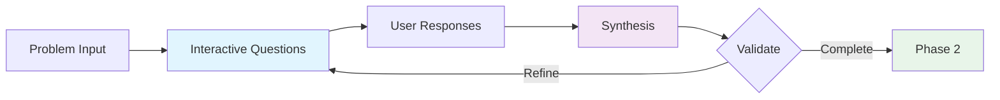
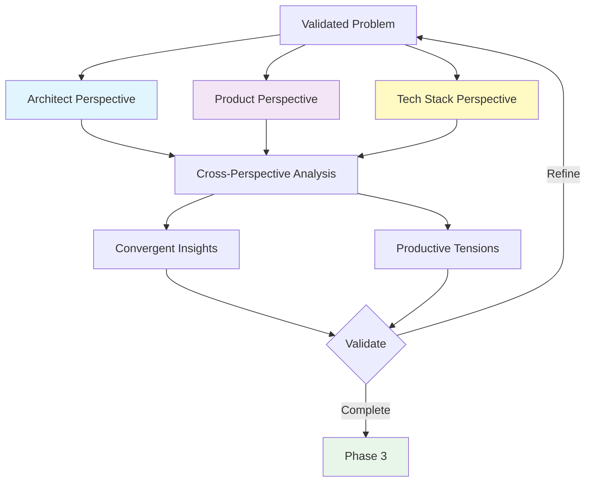
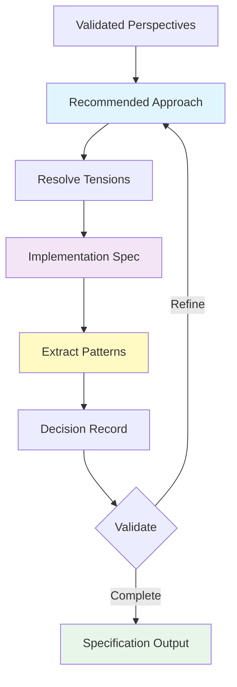

# Creative Sessions Workflow

**Purpose**: Guide for conducting effective multi-perspective creative problem-solving sessions
**Command**: `/cf:creative [task-id|description]`
**Duration**: 18-28 minutes (interactive)

---

## Overview

Creative sessions provide structured multi-perspective exploration for complex, ambiguous challenges (Level 3-4) that benefit from deep analysis before implementation. Through three interactive phases, they transform unclear problems into implementation-ready specifications with extracted reusable patterns.

**Core Value**: Reduce implementation risk and improve decision confidence through systematic exploration before committing to an approach.

---

## When to Use Creative Sessions

### Use Creative Sessions When

✅ **High Complexity with Uncertainty**:
- Level 3-4 problems without obvious solutions
- Multiple valid approaches, unclear which is best
- Significant trade-offs requiring structured analysis

✅ **Novel Challenges**:
- Problems outside established patterns in systemPatterns.md
- First-time integrations with new technologies
- Architectural decisions with long-term impact

✅ **Ambiguous Requirements**:
- Vague problem statements needing refinement
- Stakeholder alignment needed before implementation
- Edge cases not fully understood

✅ **Learning Opportunities**:
- Pattern extraction potential (reusable in 3+ scenarios)
- Team skill development in new domain
- Decision documentation for future reference

### Skip Creative Sessions When

❌ **Well-Defined Problems**:
- Clear solution approach → use `/cf:plan` directly
- Established patterns exist → reference systemPatterns.md
- Simple Level 1-2 tasks → use `/cf:code`

❌ **Time Constraints**:
- Urgent bug fixes requiring immediate action
- Time-sensitive features with clear requirements
- Problems already explored in previous sessions

❌ **Low ROI**:
- One-off implementations (no reusability)
- Throwaway prototypes or experiments
- Problems with single obvious solution

---

## Session Lifecycle

```mermaid
graph TD
    PREP[Preparation<br/>5-10 min] --> SESSION[Creative Session<br/>18-28 min]
    SESSION --> FOLLOWUP[Follow-Up<br/>Immediate]

    PREP --> P1[Review systemPatterns.md]
    PREP --> P2[Check similar solutions]
    PREP --> P3[Block calendar time]

    SESSION --> S1[Phase 1: Problem Definition]
    SESSION --> S2[Phase 2: Multi-Perspective Analysis]
    SESSION --> S3[Phase 3: Synthesis]

    FOLLOWUP --> F1[Review specification]
    FOLLOWUP --> F2[/cf:plan or /cf:code]
    FOLLOWUP --> F3[Reference patterns]

    style PREP fill:#e1f5fe
    style SESSION fill:#fff3e0
    style FOLLOWUP fill:#e8f5e9
```

---

## Preparation (5-10 minutes)

### Before Starting Session

1. **Review Existing Context**
   ```bash
   # Check for similar patterns
   grep -i "pattern-keyword" memory-bank/systemPatterns.md

   # Review active context
   /cf:sync
   ```

2. **Validate Complexity**
   - Is this really Level 3-4?
   - Could `/cf:plan` handle this?
   - Have we solved similar problems before?

3. **Block Calendar Time**
   - Reserve 30-40 minutes (session + follow-up)
   - Minimize interruptions for interactive participation
   - Have problem context readily available

4. **Prepare Context**
   - If using task-id: Ensure task in tasks.md has clear description
   - If using description: Think through problem statement
   - Gather any relevant constraints or requirements

---

## Phase 1: Problem Definition (5-8 minutes)

### Goal

Transform vague problem into clear, shared understanding before exploring solutions.

### Process



### Facilitator Questions

Expect questions exploring:

1. **Core Problem**:
   - What is the fundamental challenge?
   - What happens if we solve this incorrectly?
   - Are there non-obvious requirements?

2. **Constraints**:
   - **Technical**: Technology, architecture, integration limits
   - **Business**: UX, performance, compliance requirements
   - **Resource**: Time, complexity, skill constraints

3. **Success Criteria**:
   - How will we know we've solved this well?
   - Must-have vs nice-to-have outcomes?
   - Edge cases that must be handled?

### Your Role

**Active Participation**:
- Answer questions thoroughly
- Identify unknowns honestly ("I don't know X")
- Share context about constraints
- Think critically about edge cases

**Quality Signals**:
✅ Facilitator captures your key concerns
✅ Constraints are explicit
✅ Success criteria are measurable
✅ Known unknowns documented

**Red Flags**:
❌ Problem statement too vague
❌ Success criteria unclear
❌ Critical constraints missing
❌ Rushing past unknowns

### Validation Gate

**Facilitator presents**: Refined problem statement with requirements, constraints, success criteria

**Your decision**:
- **"yes"**: Problem understanding is complete → proceed to Phase 2
- **"refine"**: Important aspects missing → iterate on problem definition

**Tip**: Better to refine now than discover gaps during implementation.

---

## Phase 2: Multi-Perspective Analysis (8-12 minutes)

### Goal

Generate 3 distinct perspectives, identify where they agree (convergent insights) and disagree (productive tensions).

### Process



### Three Perspectives

#### 1. Architect Perspective

**Focus**: Technical approach and system design

**Addresses**:
- Component architecture and responsibilities
- Integration points with existing system
- Technical risks and mitigation strategies
- Implementation complexity assessment
- Trade-offs (performance vs simplicity, etc.)

**Example Output**:
```markdown
Technical Approach: Event-driven microservices

Components:
- Event Bus (RabbitMQ)
- Service Registry (Consul)
- API Gateway (Kong)

Integration: Existing monolith publishes events

Trade-offs:
✓ Scalability, fault isolation
⚠️ Operational complexity, distributed debugging
```

#### 2. Product Perspective

**Focus**: User needs and experience

**Addresses**:
- User problems being solved
- UX flow and interactions
- Acceptance criteria
- Edge cases from user journey
- Feature priorities

**Example Output**:
```markdown
User Needs: Avoid timeout errors on large file uploads

UX Flow:
1. Select file → Progress indicator appears
2. Upload continues in background
3. Notification on completion

Acceptance Criteria:
- Files up to 5GB supported
- Resume on network interruption
- Clear error messages

Edge Cases:
- Duplicate filename handling
- Storage quota exceeded
```

#### 3. Tech Stack Perspective

**Focus**: Stack-specific patterns and optimizations

**Addresses**:
- Recommended patterns for current tech stack
- Framework capabilities to leverage
- Performance characteristics
- Library/tool recommendations

**Example Output**:
```markdown
Stack-Specific Patterns:
- React: useReducer for complex state
- Express: Multer middleware for uploads
- PostgreSQL: JSONB for flexible metadata

Framework Integration:
- Leverage React Suspense for upload status
- Express streaming for large files

Performance:
- Streaming reduces memory footprint
- JSONB indexing for metadata queries
```

### Cross-Perspective Analysis

#### Convergent Insights

**What it is**: Areas where all 3 perspectives agree

**Example**:
```markdown
All perspectives agree:
- WebSocket necessary for real-time updates
- Conflict resolution is critical to UX
- Performance must be <100ms latency
```

**Why it matters**: High-confidence decisions with multi-framework validation

#### Productive Tensions

**What it is**: Where perspectives disagree, revealing important trade-offs

**Example**:
```markdown
Tension 1: Architect vs Product
- Architect: Eventual consistency simplifies architecture
- Product: Users expect immediate feedback
- Trade-off: Consistency model vs UX expectations

Tension 2: Product vs Tech Stack
- Product: Rich text editor with formatting
- Tech Stack: HTML sanitization adds complexity
- Trade-off: Feature richness vs security
```

**Why it matters**: Exposes hidden trade-offs requiring explicit decisions

### Your Role

**Review Each Perspective**:
- Does Architect miss technical risks?
- Does Product capture user needs accurately?
- Does Tech Stack leverage framework capabilities?

**Challenge When Appropriate**:
- "Architect perspective didn't address database scaling"
- "Product perspective missed mobile UX"
- "Tech Stack could use library X instead"

**Understand Tensions**:
- Tensions are features, not bugs
- They reveal real trade-offs
- Resolution happens in Phase 3

### Validation Gate

**Facilitator presents**: 3 perspectives + cross-perspective analysis

**Your decision**:
- **"yes"**: Perspectives comprehensive and accurate → proceed to Phase 3
- **"refine"**: Important aspects missing or incorrect → iterate

**Quality Signals**:
✅ Each perspective feels authentic and detailed
✅ Cross-perspective analysis reveals non-obvious insights
✅ Tensions identify real trade-offs (not misunderstandings)
✅ You feel confident about decision landscape

---

## Phase 3: Synthesis (5-8 minutes)

### Goal

Integrate insights, resolve tensions, produce actionable implementation specification.

### Process



### Components of Synthesis

#### 1. Recommended Approach

**What it includes**:
- Solution name (descriptive, memorable)
- Rationale integrating insights from all perspectives
- How it resolves identified tensions

**Example**:
```markdown
Approach: Hybrid CRDT + Custom Conflict UI

Rationale:
- CRDT (Yjs library) reduces Architect's implementation complexity
- Custom UI addresses Product's UX concerns for conflict visibility
- Proven library mitigates Architect's risk concerns
- Tech Stack confirms Yjs integrates well with React

Resolves Tensions:
- OT vs CRDT: CRDT chosen for simpler mental model
- Complexity vs UX: Custom UI provides UX without complex OT
```

#### 2. Implementation Specification

**What it includes**:
- Component breakdown with responsibilities
- Implementation phases (build order)
- Data flow diagrams
- Testing strategy

**Example**:
```markdown
Components:
1. WebSocket Manager: Socket.io wrapper, connection handling
2. CRDT Document Store: Yjs integration, operation sync
3. Presence Service: User tracking, cursor positions
4. Conflict UI Component: Visual indicators, resolution

Phases:
Phase 1: WebSocket + basic CRDT sync
Phase 2: Presence tracking
Phase 3: Conflict visualization UI

Data Flow:
User Edit → CRDT Update → WebSocket Broadcast → Other Clients → UI Update

Testing:
- Unit: CRDT operations isolated
- Integration: Multi-client synchronization
- Edge: Network interruption, simultaneous edits at same position
```

#### 3. Pattern Extraction

**When to extract**:
- Pattern reusable in 3+ distinct scenarios
- Clear problem-solution-tradeoff structure
- Validated through synthesis process

**Example**:
```markdown
Pattern: Real-Time Collaboration Pattern

Context: Multi-user concurrent editing scenarios

Problem: Users need to edit shared resources without conflicts

Solution: CRDT + WebSocket + Presence + Conflict UI

Benefits:
✅ Conflict-free merges (no lost edits)
✅ Sub-second synchronization
✅ Clear user feedback

Trade-offs:
⚠️ CRDT memory overhead
⚠️ Learning curve for CRDT concepts

Reusability:
1. Collaborative document editing
2. Real-time chat applications
3. Shared whiteboard tools
4. Multi-user form editing
```

**Note**: Skip extraction if pattern too specific or <3 use cases

#### 4. Decision Record

**What it includes**:
- Chosen approach
- Alternatives considered with rejection rationale
- Key trade-offs accepted
- Assumptions to validate

**Example**:
```markdown
Decision: Use Yjs CRDT library

Alternatives Considered:
1. Operational Transformation: Rejected due to implementation complexity
2. Last-Write-Wins: Rejected due to lost edit risk
3. Custom CRDT: Rejected due to development time

Trade-offs Accepted:
- CRDT memory overhead: Acceptable for <10 concurrent users
- Library dependency: Acceptable given maturity of Yjs

Assumptions to Validate:
- Yjs performance adequate for document size
- React integration works as expected
- Network latency <100ms achievable
```

### Your Role

**Validate Specification**:
- Can you start implementing from this?
- Are components clearly defined?
- Is testing strategy adequate?

**Check Decision Logic**:
- Does rationale address your concerns?
- Are trade-offs acceptable?
- Do assumptions need validation?

**Assess Patterns**:
- Are extracted patterns truly reusable?
- Is problem-solution clear?

### Validation Gate

**Facilitator presents**: Complete specification + patterns + decisions

**Your decision**:
- **"yes"**: Specification actionable for implementation → session complete
- **"refine"**: Gaps in specification or unclear decisions → iterate

**Quality Signals**:
✅ Specification detailed enough to start `/cf:plan` or `/cf:code`
✅ All tensions resolved with explicit trade-offs
✅ Testing strategy addresses edge cases
✅ Decision rationale is clear for future reference

---

## Session Output

### Memory Bank Updates

After validation, facilitator updates:

1. **activeContext.md**: Session summary with key decisions
2. **systemPatterns.md**: Extracted patterns (if any)
3. **tasks.md**: Task notes with approach and patterns to apply

### Specification Location

**Primary**: `memory-bank/activeContext.md` (Recent Changes section)

**Content**:
- Problem explored
- Solution designed
- Key decisions with rationale
- Patterns created
- Next action

**Access**: Review immediately after session or use `/cf:sync`

---

## Follow-Up Actions

### Immediate Next Steps

```mermaid
graph LR
    SESSION[Creative Session<br/>Complete] --> REVIEW[Review Spec<br/>activeContext.md]
    REVIEW --> DECIDE{Complexity?}
    DECIDE -->|Simple| CODE[/cf:code]
    DECIDE -->|Complex| PLAN[/cf:plan]
    PLAN --> CODE

    style SESSION fill:#e8f5e9
    style CODE fill:#fff9c4
    style PLAN fill:#f3e5f5
```

### Option 1: Direct Implementation

**When**: Specification is detailed and straightforward

```bash
# Implement directly
/cf:code TASK-005
```

**During implementation**:
- Reference specification in activeContext.md
- Apply patterns from systemPatterns.md
- Validate assumptions identified in decision record

### Option 2: Detailed Planning

**When**: Specification needs breakdown into sub-tasks

```bash
# Create detailed plan
/cf:plan TASK-005

# Then implement
/cf:code TASK-005-1  # First sub-task
```

**Planning phase**:
- Use specification as input
- Break components into sub-tasks
- Define phase dependencies
- Estimate effort

### Option 3: Create Task First

**When**: Session used description, no task exists yet

```bash
# Create task from specification
/cf:feature "Implement [solution name from synthesis]"

# Then plan or code
/cf:plan TASK-XXX
```

---

## Best Practices

### Session Facilitation

**Prepare for Participation**:
- Block calendar time (no multitasking)
- Review related context beforehand
- Be ready to answer questions thoughtfully

**Active Engagement**:
- Challenge perspectives when they miss aspects
- Identify unknowns explicitly
- Validate carefully at each gate

**Trust the Process**:
- Don't rush validation gates
- Refinement is normal and valuable
- Better to iterate than miss critical aspects

### Decision Quality

**Good Decisions**:
✅ Explicit trade-offs acknowledged
✅ Alternatives considered systematically
✅ Rationale references all 3 perspectives
✅ Assumptions identified for validation

**Red Flags**:
❌ "Just pick one" without analysis
❌ Ignoring productive tensions
❌ Missing obvious alternatives
❌ Unclear why approach chosen

### Pattern Quality

**Extract When**:
✅ Reusable in 3+ distinct scenarios
✅ Clear problem-solution structure
✅ Benefits and trade-offs explicit
✅ Actionable for future use

**Skip When**:
❌ Too project-specific
❌ Only 1-2 potential use cases
❌ Already exists in systemPatterns.md
❌ Too abstract or vague

---

## Common Challenges

### Challenge 1: Session Takes Longer Than Expected

**Cause**: Complex problem with many facets

**Solutions**:
- Focus on MVP scope in synthesis
- Defer nice-to-have analysis
- Break into multiple sessions if needed
- Document and schedule follow-up

### Challenge 2: Perspectives Don't Reveal Tensions

**Cause**: Problem simpler than expected or perspectives too similar

**Solutions**:
- This is valid outcome (convergent solution)
- Consider if `/cf:plan` would have been sufficient
- Document consensus for future reference
- Proceed to synthesis with confidence

### Challenge 3: Too Many Tensions, Unclear How to Resolve

**Cause**: Problem truly complex or missing information

**Solutions**:
- Prioritize tensions by impact
- Resolve critical ones, defer others
- Document assumptions to validate
- May need research before finalizing

### Challenge 4: Extracted Pattern Feels Too Specific

**Cause**: Pattern not yet generalized enough

**Solutions**:
- Wait for 2nd use case before extracting
- Document in task notes instead
- Generalize pattern after seeing variations
- Better to skip than force poor abstraction

---

## Session Anti-Patterns

### Anti-Pattern 1: Solution Jumping

**What**: Proposing solutions during Phase 1 problem definition

**Why it's bad**: Locks in approach before understanding problem

**Fix**: Actively defer solution discussion to Phase 2

### Anti-Pattern 2: Rubber Stamping

**What**: Approving validation gates without careful review

**Why it's bad**: Garbage in, garbage out - poor problem definition → poor solution

**Fix**: Take time at each gate, refine when unsure

### Anti-Pattern 3: Ignoring Tensions

**What**: Treating disagreements as errors to eliminate

**Why it's bad**: Tensions reveal real trade-offs requiring explicit decisions

**Fix**: Embrace tensions, resolve through clear trade-off analysis

### Anti-Pattern 4: Over-Engineering

**What**: Adding complexity in synthesis beyond problem needs

**Why it's bad**: Scope creep, delayed implementation

**Fix**: Focus on MVP addressing validated requirements only

---

## Integration with Project Workflow

### Session Timing

**Early in Feature**:
- After `/cf:feature` creates task
- Before `/cf:plan` breakdown
- When ambiguity is high

**Mid-Implementation** (Less common):
- When approach blocked or failing
- Significant requirements change
- New information changes landscape

### Session Frequency

**Normal Project**:
- 1-3 creative sessions per major feature
- More for novel domains
- Fewer as patterns accumulate

**Anti-Pattern**: Creative session for every task (overuse)

### Pattern Accumulation

**Over Time**:
```
Project Start: Many creative sessions → Extract patterns
Project Middle: Reference patterns → Fewer creative sessions
Project Mature: Established patterns → Rare creative sessions
```

**Healthy Sign**: Decreasing creative session frequency as systemPatterns.md matures

---

## Metrics and Outcomes

### Success Indicators

**Short-term** (During session):
- All validation gates pass with refinement <2 iterations
- Specifications feel actionable
- Patterns extracted have 3+ use cases

**Medium-term** (During implementation):
- Implementation matches specification
- Assumptions validate correctly
- Testing strategy adequate

**Long-term** (Project lifecycle):
- Extracted patterns reused successfully
- Decision rationale referenced in future
- Reduced rework from poor initial decisions

### When Session Reveals Research Needed

**Valid Outcome**: "Needs Research" next action

**Example**:
```markdown
Creative Session Outcome: Research Required

Identified Unknowns:
- Performance characteristics of CRDT at scale (>100 users)
- Browser support for WebSocket reconnection
- Yjs library TypeScript integration quality

Next Actions:
1. Benchmark testing with Yjs at target scale
2. Browser compatibility research
3. TypeScript integration POC
4. Resume creative session with findings
```

**Why it's good**: Better to discover knowledge gaps before implementation

---

## Related Documentation

- **Command Reference**: `docs/commands/cf-creative.md`
- **Command Specification**: `.claude/commands/cf/creative.md`
- **Facilitator Agent**: `.claude/agents/workflow/facilitator.md` (Mode 3: Creative Session)
- **Session Management**: `docs/workflows/session-management.md`

---

**Version**: 1.0
**Last Updated**: 2025-10-28
**Status**: Active (Phase 1 implementation)
